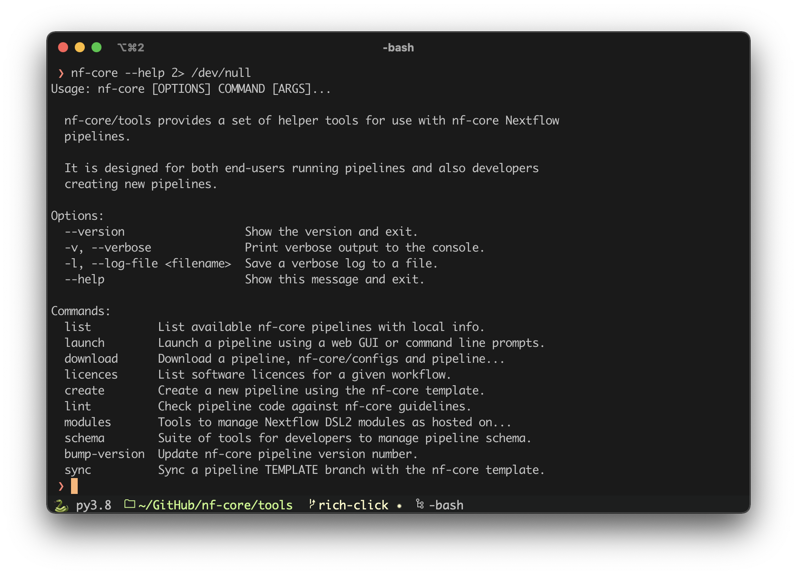
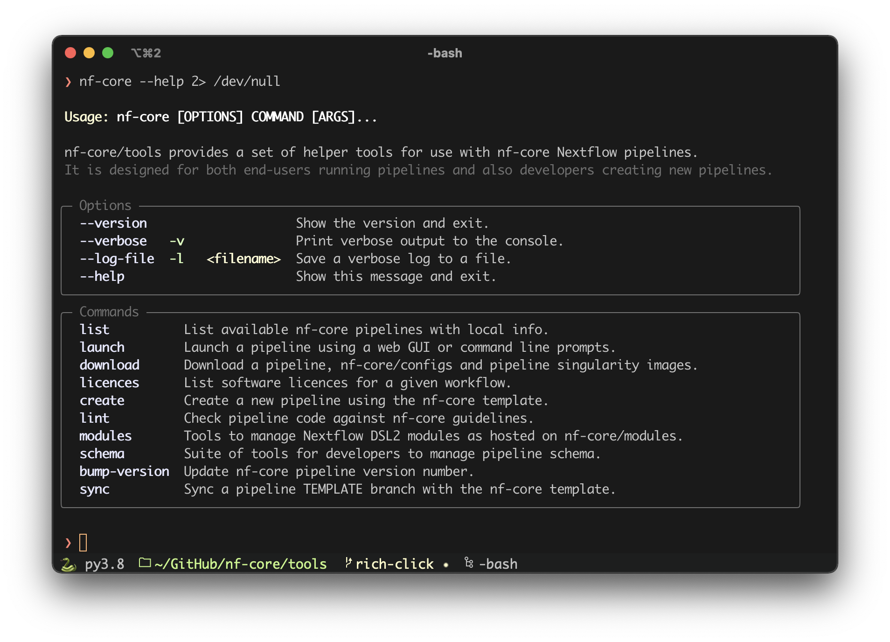

# rich-click

**Format [click](https://click.palletsprojects.com/) help output nicely with [Rich](https://github.com/Textualize/rich).**

- Click is a _"Python package for creating beautiful command line interfaces"_.
- Rich is a _"Python library for rich text and beautiful formatting in the terminal"_.

The intention of `rich-click` is to provide attractive help output from
click, formatted with rich, with minimal customisation required.

## Screenshots

<table>
    <tr>
        <th>Native click help</th>
        <th>With <code>rich-click</code></th>
    </tr>
    <tr>
        <td></td>
        <td></td>
    </tr>
</table>

## Installation

You can install `rich-click` from the Python Package Index (PyPI) with `pip` or equivalent.

```bash
python -m pip install rich-click
```

## Usage

There are two main ways to set up `rich-click` formatting for your tool.
Which you choose will depend on your use-case and your personal disposition:

### The path of least typing

Monkey patching is [probably bad](https://en.wikipedia.org/wiki/Monkey_patch#Pitfalls)
and you should only use this method if you are a Responsible Developer.
It's also good if you're lazy, as it requires very little typing.
In fact, the whole thing can be done in just four lines:

```python
import click
import rich_click
click.Group.format_help = rich_click.rich_format_help
click.Command.format_help = rich_click.rich_format_help
```

This _overwrites_ the default `click` methods with those from the `rich-click` package.
As such, no other changes are needed - just continue to use `click` as you would
normally and it will use these custom methods to print your help output.

### The good and proper way

If using monkey-patching in your project makes your palms sweaty and your pulse race,
then you'll be pleased to know that you can also use `rich-click` in a nicely
declarative and verbose manner:

```python
import click
import rich_click

class RichClickGroup(click.Group):
    def format_help(self, ctx, formatter):
        rich_click.rich_format_help(self, ctx, formatter)
class RichClickCommand(click.Command):
    def format_help(self, ctx, formatter):
        rich_click.rich_format_help(self, ctx, formatter)

@click.group(cls=RichClickGroup)
@click.option('--debug/--no-debug', default=False)
def cli(debug):
    click.echo(f"Debug mode is {'on' if debug else 'off'}")

@cli.command(cls=RichClickCommand)
def sync():
    click.echo('Syncing')
```

_(example based on the [click docs](https://click.palletsprojects.com/en/8.0.x/commands/))_

Here we are making new `Group` and `Command` child classes that are based on click.
We define our custom `format_help()` functions and then tell click to to use these classes with the `cls` argument.

## Customisation

There isn't really much you can customise yet, but this is planned.
I'm thinking:

- Colours
- Whether to print positional arguments or not
  - Could maybe provide custom args to give help text to these
- The ability to break up commands and options into multiple named panels

## Contributing

Contributions and suggestions for new features are welcome, as are bug reports!
Please create a new [issue](https://github.com/ewels/rich-click/issues)
or better still, dive right in with a pull-request.

## Credits

This package was put together hastily by Phil Ewels ([@ewels](http://github.com/ewels/)),
but the hard work was really done by Will McGugan ([@willmcgugan](https://github.com/willmcgugan))
who not only is the author of [Rich](https://github.com/Textualize/rich)
but also wrote the original code that this package is based on.
