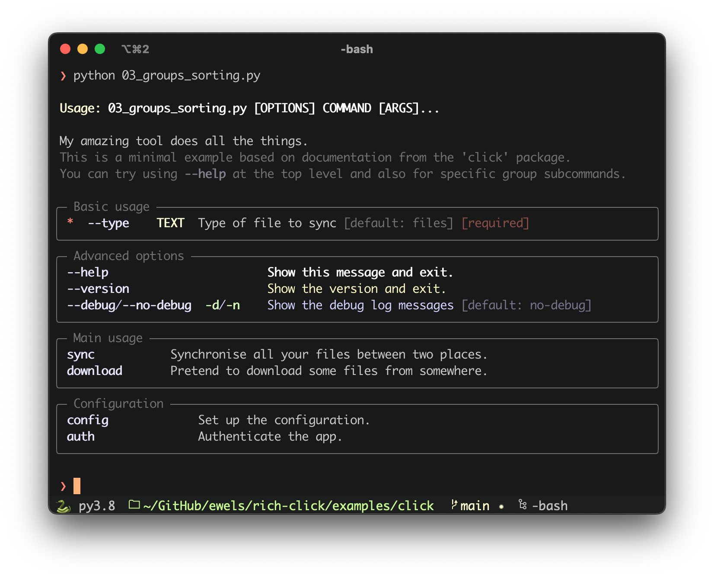

# rich-click

**Format [click](https://click.palletsprojects.com/) help output nicely with [Rich](https://github.com/Textualize/rich).**

- Click is a _"Python package for creating beautiful command line interfaces"_.
- Rich is a _"Python library for rich text and beautiful formatting in the terminal"_.

The intention of `rich-click` is to provide attractive help output from
click, formatted with rich, with minimal customisation required.

## Screenshots

<table>
    <tr>
        <th>Native click help</th>
        <th>With <code>rich-click</code></th>
    </tr>
    <tr>
        <td></td>
        <td></td>
    </tr>
</table>

## Installation

You can install `rich-click` from the Python Package Index (PyPI) with `pip` or equivalent.

```bash
python -m pip install rich-click
```

## Usage

To use `rich-click`, import it instead of `click` but under the same namespace:

```python
import rich_click as click
```

That's it. Then continue to use `click` as you would normally.

The intention is to maintain most / all of the normal click functionality and arguments.
If you spot something that is missing once you start using the plugin, please create an issue about it.

## Command groups and sorting

`rich-click` gives functionality to list subcommands in groups, printed as separate panels.
It accepts a list of commands which means you can also choose a custom sorting order.

For example, you can produce something that looks like this:


To do this, set `click.rich_click.COMMAND_GROUPS`.

In this example, we create two groups of commands for the base command of `mytool`.
Any subcommands not listed will automatically be printed in a panel at the end labelled "Commands" as usual.

```python
click.rich_click.COMMAND_GROUPS = {
    "mytool": [
        {
            "name": "Commands for uploading",
            "commands": ["sync", "upload"],
        },
        {
            "name": "Download data",
            "commands": ["get", "fetch", "download"],
        },
    ]
}
```

If you omit `name` it will use `Commands` (can be configured with `COMMANDS_PANEL_TITLE`, see below).

If you use nested subcommands, you can specify multiple base paths using
the base dictionary keys:

```python
click.rich_click.COMMAND_GROUPS = {
    "mytool": ["commands": ["sync", "auth"]],
    "mytool sync": [
        {
            "name": "Commands for uploading",
            "commands": ["sync", "upload"],
        },
        {
            "name": "Download data",
            "commands": ["get", "fetch", "download"],
        },
    ],
    "mytool auth":[{"commands": ["login", "logout"]}],
}
```

## Customisation

You can customise most things that are related to formatting.

For example, to limit the maximum width of the help output to 100 characters:

```python
click.rich_click.MAX_WIDTH = 100
```

To print the option flags in a different colour, use:

```python
click.rich_click.STYLE_OPTION = "magenta"
```

<details><summary>Full list of config options</summary>

```python
# Default colours
STYLE_OPTION = "bold cyan"
STYLE_SWITCH = "bold green"
STYLE_METAVAR = "bold yellow"
STYLE_USAGE = "yellow"
STYLE_USAGE_COMMAND = "bold"
STYLE_DEPRECATED = "red"
STYLE_HELPTEXT_FIRST_LINE = ""
STYLE_HELPTEXT = "dim"
STYLE_METAVAR = "bold yellow"
STYLE_OPTION_HELP = ""
STYLE_OPTION_DEFAULT = "dim"
STYLE_REQUIRED_SHORT = "red"
STYLE_REQUIRED_LONG = "dim red"
STYLE_OPTIONS_PANEL_BORDER = "dim"
ALIGN_OPTIONS_PANEL = "left"
STYLE_COMMANDS_PANEL_BORDER = "dim"
ALIGN_COMMANDS_PANEL = "left"
MAX_WIDTH = None # Set to an int to limit to that many characters

# Fixed strings
DEPRECATED_STRING = "(Deprecated) "
DEFAULT_STRING = " [default: {}]"
REQUIRED_SHORT_STRING = "*"
REQUIRED_LONG_STRING = " [required]"
OPTIONS_PANEL_TITLE = "Options"
COMMANDS_PANEL_TITLE = "Commands"

# Behaviours
SHOW_ARGUMENTS = False
```

</details>

## Contributing

Contributions and suggestions for new features are welcome, as are bug reports!
Please create a new [issue](https://github.com/ewels/rich-click/issues)
or better still, dive right in with a pull-request.

## Credits

This package was put together hastily by Phil Ewels ([@ewels](http://github.com/ewels/)),
but the hard work was really done by Will McGugan ([@willmcgugan](https://github.com/willmcgugan))
who not only is the author of [Rich](https://github.com/Textualize/rich)
but also wrote the original code that this package is based on.
