# Improving `--help` for AI agents

As we move into the era of agentic-AI, the tools we build are no longer just for humans.
Agents are now extremely capable of using CLI tools and more and more people are
turning to them to run their workloads. This is great news, especially for anyone
who has already spent time developing beautiful and well designed terminal tools using
libraries such as, say, `rich-click` ;)

However, there is room for improvement.

Just like humans, agents need to understand a CLI to know how to use it.
Just like humans, they run `--help` to figure out how.
If your CLI tool has a large surface
area with many nested subcommands, you'll see your agent sessions running
`--help` again and again as they explore the CLI structure, poking around trying
to find what commands are available and how to use them. This takes time, and tokens.

Version v1.10 of `rich-click` brings with it some new features to help both agents and people.
I found this work quite interesting, so this blog post explains how I came to the final design.

!!! tip "TL;DR;"

    Version v1.10 of `rich-click` brings with it some new features to help both agents and people:

    - Auto-detection of when an agent is using your CLI, which triggers:
        - Return of help for _all subcommands_, in addition to the requested command
        - Tailored "compact" output, saving characters and tokens
    - New optional value for `--help` flag to return in multiple formats: `compact`, `markdown`, `json`
        - Ability to plug into `rich-click` to inject custom handlers for your own help formats
    - New syntax to provide example usage for commands
    - Improved error messages for certain error classes

<!-- more -->

## Initial hypothesis

I started this work after watching Claude Code stumble around exploring the [nf-core CLI](https://github.com/nf-core/tools).
It's fairly large and can be non-trivial to use, and every new session would fall into the same usage traps.
Yes, I could write instructions into `CLAUDE.md` / `AGENTS.md` or build a skill, but I was curious about how to make a more general improvement that could improve this for all CLIs using `rich-click`.

My initial hypothesis was basically three things:

1. Agents like markdown. Let's try returning help as markdown instead.
2. Agents like examples. Let's return examples.
3. To reduce multiple calls, let's hint at all subcommands with [progressive disclosure](https://medium.com/@martia_es/progressive-disclosure-the-technique-that-helps-control-context-and-tokens-in-ai-agents-8d6108b09289).

Ok, to be fair I actually started with JSON, but pretty quickly thought markdown would be better.
I kept JSON in because I think it could be useful for folks building applications on top of CLIs.

!!! note "JSON help output"
    That's right - `rich-click` can now export your CLI's usage in a structured JSON format.
    This means that you can now pretty easily build an MCP, a TUI, an interactive webpage, whatever,
    on top of your rich-click CLI without worrying about keeping the usage specs aligned.

## How it works

The first question was how to give the option of altering `--help` output to users.

Rather than introducing a new CLI flag to all CLIs using `rich-click`, I chose to piggy-back on the existing `--help` flag.
This allows us to inject new functionality with as little change to existing CLIs as possible.

By patching `--help` we can keep existing functionality but also allow it to take a value, specifying the format:

- `--help`: Regular help output. Same behaviour as before
- `--help foo`: Regular help output. Click already eats and silently ignores unrecognised values, so no change.
- `--help markdown`: Return help as markdown
- `--help json`: Return help as JSON

Rather than hoping that agents will learn this pattern or notice it in the help text, I opted for automatic detection.
This will always work on the first attempt, helping with efficiency and token use from the off.

Thankfully, pretty much all LLMs inject some kind of environment variable into their shell environments when running commands.
Vercel maintains an excellent [`@vercel/detect-agent` package](https://www.npmjs.com/package/@vercel/detect-agent)
on npm to do exactly this. I was able to effectively vendor the package, copying the names and logic into `rich-click`
so that we know when an agent is using the CLI.
(Side note: LLM providers / harness authors: _please_ standardise on `$AI_AGENT` and / or `$AGENT`!)

The only exception to this rule is when running tests. People write tests for their help text, and we don't want
tests to start failing if an agent runs them. So we also detect _those_ environment variables (eg. `PYTEST_CURRENT_TEST`)
and disable the agent behaviour if found. Same thing for [`rich-codex` screenshots](https://github.com/ewels/rich-codex).
Let us know if you want us to add any additional exceptions.

So, with this we should get the best of both worlds:

- No change to default behaviour, no new CLI flags
- Options for humans to choose the help format they want
- Automatically provide the best output for agents
- Tests don't break (hopefully)

## Benchmarking

I ran this all past [Daniel](https://github.com/dwreeves), the other maintainer for `rich-click`.
He had a healthy degree of skepticism (as all maintainers should!) and asked if it was possible
to benchmark it to see if it really _did_ improve agent performance, and importantly if it made it worse.

I got to work with Claude (Fable) and asked it to design and create a benchmarking framework for me.
This ended up quite a fun project, proving several of my assumptions wrong and leading to what I
hope is a better final product.

### Building a CLI that no model had seen before

I couldn't benchmark agent performance with an existing CLI.
Models will have seen their documentation and source code during training.
Instead, Claude built a synthetic CLI for me called `quorv`. All of its command names,
options and values are invented words not found in the dictionary. The descriptions are
plain English.

Then we gave different agents tasks to complete with this CLI. A task looks like this:

> _Add a record with the annotation "brindle count", mode crox, and a weight of 12._

The required command is:

```sh
quorv plarv crell --crull "brindle count" --kolm crox --wover 12
```

There should be no way to guess the mapping, thus forcing the agent to read `--help`.

Agents are _really_ good at using CLI tools, so in order to get any differentiation
to see if my changes had an effect, I needed to make the CLI very complex.

The final version of `quorv` has 132 commands in 28 groups, with some commands
five levels deep. That works out to 160 help pages. It has required options,
choice values, file inputs, interactive prompts, and commands with rules that
span multiple options. It has enough horrible edge cases to look like a real
CLI.

Some of the tasks ended up really nasty 😆

> Connect the record annotated 'anchor stone' to whichever other record in this store has the highest weight, so that the anchor record points at it. That connection must have a strength of 9, and it must be the only connection in the store.

> Temper the bundle named 'lantern' the sorv way, with the weave 'ember lattice'.

As they get harder, the models start getting really creative on how to pass,
so instructions had to be explicit about only using the CLI and even include
features to detect if the model cheated.
I saw multiple examples of agents escaping their workspaces and using the benchmark
repository's shared store instead (the audit logs caught this). One Codex run also
edited the activity journal directly. The hash chain caught that too.
It's possible that other agents got away with it, but hopefully the replicates reduce
the impact. I'll never know if any hacked HuggingFace to solve their tasks!

Claude wrote 40 tasks for me and ran dispatched a load of agents in sandboxes
(being careful to avoid bringing over any memory of the overarching project)
with Claude Code using Haiku 4.5, plus Codex CLI using GPT-5.4-mini.
The smallest models showed the most differentiation across conditions so
gave the most interesting results.

Each run started with a fresh store. `quorv` logged every invocation and wrote a
hash-chained journal for state changes. A deterministic grader checked the final
state and the logs. There was no LLM judge involved. Each agent and task was
run with multiple replicates to give a range of uncertainty.

Across four rounds of testing, I ended up with more than 2,400 graded runs.

### Markdown made basically no difference

The new `--help markdown` option returns help as markdown.

Regular rich-click help looks like this:

```

 Usage: quorv plarv crell [OPTIONS]

 Create a record.
 Aliases: cl

╭─ Options ────────────────────────────────────────────────────────────────────────────────────────╮
│ *  --crull  TEXT                 Annotation text for the record. [required]                      │
│    --kolm   [pelm|crox|zeff]     Mode of the record. [default: pelm]                             │
│    --wover  INTEGER              Weight of the record. [default: 7]                              │
│    --torv   TEXT                 Label to attach; repeat for several.                            │
│    --murd   TEXT                 Steward name. [env var: QUORV_MURD] [default: veld]             │
│    --help   [markdown|json|...]  Show this message and exit.                                     │
╰──────────────────────────────────────────────────────────────────────────────────────────────────╯
╭─ Examples ───────────────────────────────────────────────────────────────────────────────────────╮
│ - Create a record:                                                                               │
│     quorv plarv crell --crull 'north ledger'                                                     │
│                                                                                                  │
│ - Create a record with a mode and a weight:                                                      │
│     quorv plarv crell --crull 'north ledger' --kolm crox --wover 12                              │
│                                                                                                  │
│ - Create a record carrying two labels:                                                           │
│     quorv plarv crell --crull 'north ledger' --torv brindle --torv ember                         │
╰──────────────────────────────────────────────────────────────────────────────────────────────────╯
```

Markdown looks like this:

```markdown
# `quorv plarv crell`

Create a record.

**Aliases:** `cl`

**Usage:** `quorv plarv crell [OPTIONS]`

## Examples

- Create a record: `quorv plarv crell --crull 'north ledger'`
- Create a record with a mode and a weight: `quorv plarv crell --crull 'north ledger' --kolm crox --wover 12`
- Create a record carrying two labels: `quorv plarv crell --crull 'north ledger' --torv brindle --torv ember`

## Options

| Option | Type | Required | Default | Description |
| --- | --- | --- | --- | --- |
| `--crull` | String | yes |  | Annotation text for the record. |
| `--kolm` | choice: pelm / crox / zeff |  | `pelm` | Mode of the record. |
| `--wover` | Int |  | `7` | Weight of the record. |
| `--torv` | String (repeatable) |  |  | Label to attach; repeat for several. |
| `--murd` | String |  | `veld` | Steward name. [env: QUORV_MURD] |
| `--help` | choice: markdown / markdown-full / json / json-full / carapace / compact |  |  | Show this message and exit. |
```

The first surprise was that models did not care whether the help was Markdown,
or normal terminal output.

In fact, the initial progressive-disclosure Markdown
implementation was _worse_ than regular `--help` output. It seems that by
including some information about subcommands but not everything, the models would
guess the subcommand usage, fail, and end up running the subcommand `--help` anyway.

Once I compared the different formats with equivalent content, their success rates
and effeciency were basically identical.

### Examples didn't help either

LLMs are excellent at copying patterns, so I thought that seeing some valid usage commands would help.
But again, they made basically no difference: success rates were the same.



> _Success under regular rendered help, with vs without examples and v1.9.8 (no examples). 95% Wilson intervals (40 tasks × 1 repeat). Paired per-task bootstrap deltas: Haiku A−N 2.5 pts in examples' favour [-12.5, +7.5] — flat; GPT-5.4-mini A−N 5.0 pts [-12.5, +0.0] — the interval touches zero at its boundary._

I'm not too put off by these results. I think examples will be useful for
humans so they're worth keeping, and their utility will be very dependent
on the specific tasks in question and how the examples were written.
They didn't seem to do any harm to the agents so there's no reason not to keep them in.

### Better error messages helped a bit

During the initial benchmark analysis, Claude saw a pattern in the errors that
agents were seeing and how they were responding. As a result, the AI response gets
a bit more guidance when certain errors are encountered: `rich-click` returns the
exact command it attempted, a plain description of the broken rule, and the relevant
CLI help path. For example:

```text
Error: Invalid value for '--kolm': 'bogus' is not one of 'pelm', 'crox', 'zeff'.

Attempted: quorv plarv crell --crull x --kolm bogus
Rule: '--kolm' must be one of: pelm, crox, zeff.
Usage: quorv plarv crell [OPTIONS]
Help: quorv plarv crell --help
```

On certain really difficult tasks with the simplest models, this seems to help
a tiny bit with efficiency and avoiding "doom loops" where the agent just keeps
trying the bad command again and again.



> _Haiku 4.5 on the seven option-rule tasks. Each dot is a replicate attempt: 3 reps for diagnosis-on, 9 for diagnosis-off. A filled dot is a passed run. T27, whose command demands one option pair for one mode and a different pair for the other, falls from 2/3 to 1/9 without diagnosis. GPT-5.4-mini passed 62/63 runs regardless._

This improvement is likely highly model-specific and the differentiation
only visible on super complex CLIs / tasks, plus models are only getting better.
But as with the examples, it's purely additive so there seems no reason not to
include it.

## How much help should a `--help` flag return?

As you can see, the first set of benchmarking results were a little depressing.
However, there was one chink of light: I had also included the `--help markdown-full`
option, and _that_ did show improved results.

This option returns the full help for the command and all subcommands.
It doesn't cut any "progressive-disclosure" corners, it just dumps the whole thing
in one go. This means that the agent could can find the right command right away, without repeatedly calling `--help` as it moves through the hierarchy.

This was good, but I was worried about token usage and bloating session context.
I expanded the size of the CLI to make it truly massive.
I was only poking around token effeciency, yet to my surprise the behaviour changed
completely and suddenly the full markdown output was much _worse_ than regular help again.



> _Number of help lookups per task for the two ends of the ladder, measured on the 36-command CLI (round 1) and the 132-command CLI (round 3). "Everything at once" wins only while it fits in one response._

It turns out that Claude Code cuts CLI tool output at about 30,000 characters.
The expanded 132-command CLI full-help was now spitting out 80,176 characters and so
the agent only saw the first part of it. If it needed a command that was further down
the tree, it would run `--help` again and again, piping to `grep` and `head` to
try to capture the relevant part. Some full-tree runs had up to 71 byte-identical
repeat `--help` calls as it did this.

For smaller CLIs, my fears about token usage were unfounded - any additional
token usage was easily worth it due to the agent doing fewer `--help` calls overall
and getting to the solution faster.
However, as soon as the help output hit the 30,000 character limit, the performance
dive-bombed.

Markdown help averaged about 3.3 characters per token, regular `rich-click` help is
worse, reaching 7.1. So the question became: how do we keep as much information
as possible in as few characters as possible.

### Making the format compact

At this point, the solution became much less clever. I needed to fit more help
into fewer characters.

The new `compact` format has one line per record, with no tables or layout
padding. It only uses notation that already appears in normal CLI help. An
asterisk marks a required option. Pipes separate choices; `...` means
repeatable.

For one command, it looks like this (see [above](#markdown-made-basically-no-difference) for the same command in rich-click and markdown formats):

```text
# plarv crell [aliases: cl] — Create a record.
*--crull TEXT  Annotation text for the record.
--kolm pelm|crox|zeff  Mode of the record. [default: pelm]
--wover INTEGER  Weight of the record. [default: 7]
--torv TEXT ...  Label to attach; repeat for several.
--murd TEXT  Steward name. [default: veld] [env: QUORV_MURD]
examples:
- quorv plarv crell --crull 'north ledger'
- quorv plarv crell --crull 'north ledger' --kolm crox --wover 12
- quorv plarv crell --crull 'north ledger' --torv brindle --torv ember
```

The normal rendered version is 2,025 characters. Compact is 511.
Across the entire `quorv` tree, full Markdown takes 80,176 characters. Compact
takes less than a third of that, with 25,335.

### Made for monsters

For really really big CLIs we might still hit the character limit, no matter how
much we compress the output format.
To cater for this, I kept in an adaptive renderer, which works out how long the
compact output will be - if it's too long, it trims a small amount of distant detail,
rather than letting Claude Code chop the response at an arbitrary point.

The renderer works breadth-first from the requested command. Nearby commands
get full details first. If the complete tree fits, the agent gets everything.
If it doesn't, the least relevant detail drops away until the output is under
budget.

### Checking real rich-click CLIs

`quorv` is deliberately massive, so I wanted to know how often this would matter
in practice.

To do this, I downloaded the source code for all 786 PyPI packages that depended on rich-click
at the time of the analysis. A static scanner found a CLI in 743 of them and
counted commands, options, and help text without executing any package code. I
then fitted a character model against real renders from `quorv`.

The median CLI had five commands. Its estimated full Markdown help was about
5,700 characters; compact was about 2,500. In other words; most CLIs are nowhere near the
character truncation limit.



> _All 743 rich-click CLIs on PyPI, bucketed by estimated help size in characters. The two series are the same CLIs measured in the two formats. The compact distribution shifts left of both dashed thresholds. Sizes assume every command gains examples. Static analysis undercounts CLIs that register commands dynamically, so the right-hand tail is, if anything, larger._

The compact format affects 63 CLIs out of the 743, getting them below the 25,000-character threshold. Another 44 were too large in both formats, so those still need adaptive disclosure.

??? note "Are more popular CLIs bigger?"

    I couldn't help nerding out a bit over these numbers.
    And yes, it turns out that the more a package is downloaded, the more likely it
    is to have a bigger CLI (if you squint a bit). So now you know.

    

    > _Downloads per month against estimated compact help size, all 743 CLIs. Both axes are logarithmic: downloads span almost six orders of magnitude, sizes span three. The 192 packages with zero recorded downloads sit on the left edge. Only 44 CLIs sit above the 25,000-character budget._

These are estimates. Dynamic command registration is hard to see statically,
so some of the biggest CLIs will be undercounted.

## Testing the final design

Once compact became the proposed agent default, I ran another 240 trials. Each
model attempted all 40 tasks with regular help, compact help, and adaptive
Markdown. Error diagnosis and examples were enabled in all three conditions.

There was no measurable difference in task success. However, as I had initially
hoped, the agents were now taking fewer turns to get to the result:



> _Help lookups per task in the follow-up round._

Not only that, but the tokens used and time taken also improved:

Metric | Haiku 4.5: Regular | Haiku 4.5: Compact | GPT-5.4-mini: Regular | GPT-5.4-mini: Compact |
| --- | ---: | ---: | ---: | ---: |
| Help reads per task | 4.4 | 1.4 _(32%)_ | 7.2 | 1.8 _(25%)_ |
| Turns per task | 10.1 | 6.6 _(65%)_  | - | - |
| Wall time per task | 21.0s | 16.7s _(80%)_ | 52s | 34s _(65%)_ |
| Tokens processed per task | 250k | 185k _(74%)_ | 280k | 214k _(76%)_ |

## Conclusion

This was a fun side-project to do. It's another great example of why benchmarking
is so important with anything to do with AI. I came in with a set of expectations
which turned out to be almost entirely incorrect, but along the way my testing
uncovered some stuff which did help and that's now going to hopefully improve
agent usage and effeciency in the hundreds of CLIs that use `rich-click` to render
their help texts.

I hope that this blog post also inspires authors of other CLI frameworks to add
functionality to make their help text agent-friendly. If we can work together and
share findings, everyone can benefit.

If you have ideas for improvements, or find that the new functionality has broken
something, drop an issue on the [`rich-click` GitHub repo](https://github.com/ewels/rich-click).
I hope that the new functionality and the read are useful.
