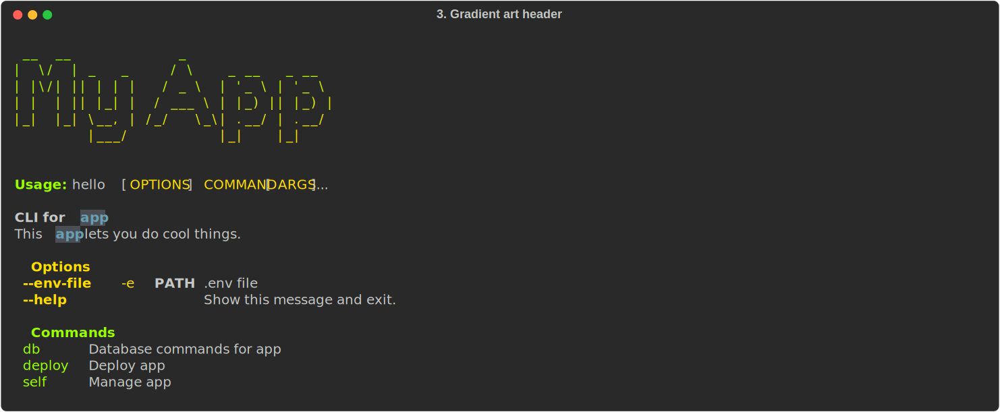

# Three cool pre-made styles for your CLI

**rich-click**'s default style is nice, and naturally it's what most of our users end up using.
But we won't be offended if you want to change things up!

**rich-click** is flexible in terms of the custimisation options it gives you.
In this blog post, we want to highlight a few neat design ideas for your CLI that you can do with **rich-click**.

<!-- more -->

## 1. Simple boxless one-color CLI

You may associate **rich-click** with boxes, but did you know you can strip the box away?

Here is an example of a **rich-click** style that does just that, and produces a nice and clean one-color format:

??? success "Code for `1. Simple boxless one-color CLI`"

    ```python
    # /// script
    # dependencies = [
    #   "rich-click",
    # ]
    # ///
    import rich_click as click
    
    help_config = click.RichHelpConfiguration(
        style_options_panel_box="SIMPLE_HEAD",
        style_commands_panel_box="SIMPLE_HEAD",
        style_options_panel_border="bold",
        options_panel_title="[u]Options[/]",
        style_commands_panel_border="bold",
        commands_panel_title="[u]Commands[/]",
        style_option="blue",
        style_usage="",
        style_usage_command="",
        style_argument="blue",
        style_switch="bold blue",
        style_command="blue",
        style_metavar="dim",
        text_markup="markdown",
        max_width=100
    )
    
    @click.group("app")
    @click.option("--env-file", "-e", type=click.Path(), help=".env file")
    @click.rich_config(help_config=help_config)
    def cli():
        """
        CLI for `app`
    
        This `app` lets you do cool things.
        """
    
    @cli.command("db")
    def deploy():
        """Database commands for app"""
    
    @cli.command("deploy")
    def deploy():
        """Deploy app"""
    
    @cli.command("self")
    def self():
        """Manage app"""
    
    
    if __name__ == "__main__":
        cli()
    ```

{.screenshot}

## 2. Dark mode / light mode aware with three colors

For now, neither Rich nor **rich-click** has a concept of dark mode or light mode.
However, there are third party packages that can detect the background color of most terminals.
Checking the terminal bg makes using RGB hex values much easier.

Here is an example of such a tool you can use:

=== "pip"
    ```shell
    pip install term-background
    ```

=== "uv"
    ```shell
    uv add term-background
    ```

=== "Rye"
    ```shell
    rye add term-background
    rye sync
    ```

The following example looks great in both dark and light terminals!

??? success "Code for `2. Dark mode / light mode aware with three colors`"

    ```python
    # /// script
    # dependencies = [
    #   "rich-click",
    #   "term-background",
    # ]
    # ///

    import rich_click as click
    from term_background import is_dark_background
    
    if is_dark_background():
        primary_color = "#99bbf2"
        secondary_color = "#c099f2"
        tertiary_color = "#d1d43d"
    else:
        primary_color = "#2b569c"
        secondary_color = "#5c2b9c"
        tertiary_color = "#c4b74f"
    
    
    help_config = click.RichHelpConfiguration(
        style_option=f"bold {secondary_color}",
        style_argument=f"bold {tertiary_color}",
        style_command=f"bold {primary_color}",
        style_switch=f"bold {secondary_color}",
        style_metavar=tertiary_color,
        style_metavar_separator="",
        style_usage=f"bold {primary_color}",
        style_usage_command="",
        style_helptext_first_line="bold",
        style_helptext="",
        style_option_default=tertiary_color,
        style_required_short="bold red",
        style_required_long="red",
        style_options_panel_border=f"dim {secondary_color}",
        style_commands_panel_border=f"dim {primary_color}",
        text_markup="markdown",
        max_width=120
    )
    
    
    @click.group("app")
    @click.option("--env-file", "-e", type=click.Path(), help=".env file")
    @click.rich_config(help_config=help_config)
    def cli():
        """
        CLI for `app`
    
        This `app` lets you do cool things.
        """
    
    @cli.command("db")
    def deploy():
        """Database commands for app"""
    
    @cli.command("deploy")
    def deploy():
        """Deploy app"""
    
    @cli.command("self")
    def self():
        """Manage app"""
    
    
    if __name__ == "__main__":
        cli()
    ```

=== "Dark mode"
    {.screenshot}


=== "Light mode"
    {.screenshot}

## 3. Gradient art header

The following example combines ideas from the first two examples, and then adds in `text2art` from the `art` package with `Gradient` from the `rich-gradient` package.

The below example requires `rich-click>=1.8.4`, as previous versions do not support `Gradient()` objects for the `header_text`.

=== "pip"
    ```shell
    pip install term-background art rich-gradient
    ```

=== "uv"
    ```shell
    uv add term-background art rich-gradient
    ```

=== "Rye"
    ```shell
    rye add term-background
    rye add art
    rye add rich-gradient
    rye sync
    ```

??? success "Code for `3. Gradient art header`"
    ```python
    # /// script
    # dependencies = [
    #   "rich-click>=1.8.4",
    #   "term-background",
    #   "art",
    #   "rich-gradient",
    # ]
    # ///
    import rich_click as click
    from art import text2art
    from rich_gradient import Gradient
    from term_background import is_dark_background
    
    
    if is_dark_background():
        primary_color = "#99ff00"
        secondary_color = "#ffdd00"
    else:
        primary_color = "#77bb22"
        secondary_color = "#aa9922"
    
    
    help_config = click.RichHelpConfiguration(
        style_options_panel_box="SIMPLE",
        style_commands_panel_box="SIMPLE",
        style_option=f"bold {secondary_color}",
        style_argument=secondary_color,
        style_command=primary_color,
        options_panel_title="[u]Options[/]",
        commands_panel_title="[u]Commands[/]",
        style_switch=secondary_color,
        style_metavar="bold",
        header_text=Gradient(text2art("My App"), colors=[primary_color, secondary_color]),
        style_metavar_separator="",
        style_usage=f"bold {primary_color}",
        style_usage_command="",
        style_helptext_first_line="bold",
        style_helptext="",
        style_option_default="",
        style_required_short="bold",
        style_required_long="",
        style_options_panel_border=f"bold {secondary_color}",
        style_commands_panel_border=f"bold {primary_color}",
        text_markup="markdown",
        max_width=120
    )
    
    
    @click.group("app")
    @click.option("--env-file", "-e", type=click.Path(), help=".env file")
    @click.rich_config(help_config=help_config)
    def cli():
        """
        CLI for `app`
    
        This `app` lets you do cool things.
        """
    
    @cli.command("db")
    def deploy():
        """Database commands for app"""
    
    @cli.command("deploy")
    def deploy():
        """Deploy app"""
    
    @cli.command("self")
    def self():
        """Manage app"""
    
    
    if __name__ == "__main__":
        cli()
    ```

{.screenshot}

## Parting notes

Thank you for reading, and I hope you find this blog helpful and inspiring.

Phil and I have been really busy on a bunch of other things, but we haven't forgotten about our roadmap for **rich-click** 1.9.
We hope to get `1.9.0` released by the middle of 2025.
Stay tuned for more updates!

Lastly, if you are attending [PyCon Sweden](https://www.pycon.se/) on November 14-15, 2024, be sure to check out [Phil Ewels' talk about **rich-click**](https://pretalx.com/pyconse-2024/talk/XP7GWN/).
