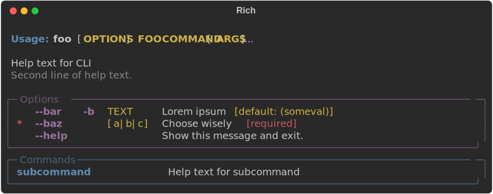
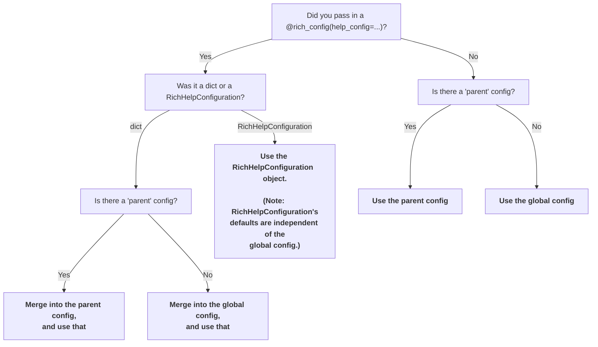

# New blog + v1.8 released!

Today we are very happy to release version 1.8 of rich-click,
and along with it - this blog!

<!-- more -->

## New docs website and blog

Until now, **rich-click** has just had a GitHub repo and all documentation has been in the README. Now, we have full docs! We've fleshed out the documentation from the README, and we'll continue to add to it over time.

### Live Style Editor

The coolest addition allowed by this change to full documentation is the [Live Style Editor](https://ewels.github.io/rich-click/editor).

We built this to address a problem we noticed, which is that the vast majority of users rely on the default **rich-click** styles.
Although we do think **rich-click**'s defaults are pretty good, it pointed to a potential developer experience issue that so many CLIs relied on the defaults.
We hope that the live style editor makes it easier for users to make style changes and to personalize their CLIs. 😁

Here is an example of a style that Phil made with the style editor:

??? success "Phil's Generated Code"

    ```python
    import rich_click as click
    
    help_config = click.RichHelpConfiguration(
        style_option="bold cyan",
        style_argument="bold cyan",
        style_command="bold green",
        style_switch="bold green",
        style_metavar="green",
        style_metavar_separator="dim blue",
        style_usage="bold italic magenta",
        style_usage_command="bold yellow",
        style_helptext_first_line="bold italic white",
        style_helptext="dim italic yellow",
        style_option_default="bold yellow",
        style_required_short="bold red",
        style_required_long="bold red",
        style_options_panel_border="italic blue",
        style_commands_panel_border="italic blue"
    )
    
    @click.group("my-command")
    @click.argument("foo")
    @click.option("--bar", "-b", help="Lorem ipsum", show_default="someval")
    @click.option("--baz", required=True, help="Choose wisely", type=click.Choice(["a", "b", "c"]))
    @click.rich_config(help_config=help_config)
    def cli(foo, bar):
        """
        Help text for CLI
    
        Second line of help text.
        """
    
    @cli.command("subcommand")
    def subcommand(foo, bar):
        """Help text for subcommand"""
    
    if __name__ == "__main__":
        cli()
    ```

{.screenshot}

And here's one that Daniel made:

??? success "Daniel's Generated Code"

    ```python
    import rich_click as click

    help_config = click.RichHelpConfiguration(
        style_option="bold magenta",
        style_argument="bold yellow",
        style_command="bold blue",
        style_switch="bold magenta",
        style_metavar="yellow",
        style_metavar_separator="",
        style_usage="bold blue",
        style_usage_command="",
        style_helptext_first_line="bold",
        style_helptext="",
        style_option_default="yellow",
        style_required_short="bold red",
        style_required_long="red",
        style_options_panel_border="magenta",
        style_commands_panel_border="blue"
    )
    
    @click.group("my-command")
    @click.argument("foo")
    @click.option("--bar", "-b", help="Lorem ipsum", show_default="someval")
    @click.option("--baz", required=True, help="Choose wisely", type=click.Choice(["a", "b", "c"]))
    @click.rich_config(help_config=help_config)
    def cli(foo, bar):
        """
        Help text for CLI
    
        Second line of help text.
        """
    
    @cli.command("subcommand")
    def subcommand(foo, bar):
        """Help text for subcommand"""
    
    if __name__ == "__main__":
        cli()
    ```

{.screenshot}

## **rich-click** version 1.8

### Generate HTML and SVG with the `rich-click` CLI

The `rich-click` CLI now allows for `--output svg` and `--output html` to help easily generate outputs for READMEs and docs:

```shell
rich-click --output svg path.to.my.cli:main --help
```

{.screenshot}

### Easier decorator API

The `rich_config()` decorator API is now easier to use:
You can pass a `dict` into the `@click.rich_config()` decorator. E.g.:

```python
@click.command
@click.rich_config(help_config={"max_width": 100})
def my_command():
    ...
```

Additionally, `dict`s behave a little differently than `RichHelpConfiguration` when dealing with parents,
and this behavior can be useful in some contexts.
Basically, the child command uses the parent's help config as a baseline, and only updates the fields specified in the dict.
So in the following example, `my_group` will have `style_option="red"`, and `my_subcommand` will have _both_ `style_option="red"` and `style_argument="green"`.

```python
@click.group
@click.rich_config(help_config={"style_option": "red"})
def my_group():
    ...

@my_group.command
@click.rich_config(help_config={"style_argument": "green"})
def my_subcommand():
    ...
```

This can be a little confusing, so we've defined explicit rules (and enforced them in unit tests) for how the config is resolved (these are also in our docs):



### More style options

The biggest addition to **rich-click**'s styling options was control over panel styles:

- `STYLE_OPTIONS_PANEL_BOX`
- `STYLE_COMMANDS_PANEL_BOX`
- `STYLE_ERRORS_PANEL_BOX`

Here's a silly example of what this can do:

??? note "Code for silly example"

    ```python
    import rich_click as click
    
    help_config = click.RichHelpConfiguration(
        style_options_panel_box="ASCII",
        style_commands_panel_box="HEAVY",
    )
    
    @click.group("app")
    @click.option("--env-file", "-e", type=click.Path(), help=".env file")
    @click.rich_config(help_config=help_config)
    def cli():
        """
        CLI for `app`
    
        This `app` lets you do cool things.
        """
    
    @cli.command("db")
    def deploy():
        """Database commands for app"""
    
    @cli.command("deploy")
    def deploy():
        """Deploy app"""
    
    @cli.command("self")
    def self():
        """Manage app"""
    
    
    if __name__ == "__main__":
        cli()
    ```


{.screenshot}


Here's a simple, stylish, and sleek example that would look great in your app:

??? note "Code for stylish example"

    ```python
    import rich_click as click
    
    help_config = click.RichHelpConfiguration(
        style_options_panel_box="SIMPLE_HEAD",
        style_options_table_box="SIMPLE_HEAD",
        style_commands_panel_box="SIMPLE_HEAD",
        style_commands_table_box="SIMPLE_HEAD",
        style_options_panel_border="bold",
        options_panel_title="[u]Options[/]",
        use_rich_markup=True,
        style_commands_panel_border="bold",
        commands_panel_title="[u]Commands[/]",
        style_option="green",
        style_usage="",
        style_usage_command="",
        style_argument="green",
        style_switch="dim green",
        style_command="green",
        style_metavar="dim",
    )
    
    @click.group("app")
    @click.option("--env-file", "-e", type=click.Path(), help=".env file")
    @click.rich_config(help_config=help_config)
    def cli():
        """
        CLI for `app`
    
        This `app` lets you do cool things.
        """
    
    @cli.command("db")
    def deploy():
        """Database commands for app"""
    
    @cli.command("deploy")
    def deploy():
        """Deploy app"""
    
    @cli.command("self")
    def self():
        """Manage app"""
    
    
    if __name__ == "__main__":
        cli()
    ```


{.screenshot}


### Improvements to option and command group API

The option groups and command groups are a very powerful and useful feature, but historically they've been tricky to work with.
The changes we've made in 1.8 improve on the API in a few substantial ways.

#### Better command path resolution

First, group keys used to only read from the `ctx.command_path`.
Now they read from the `ctx.command_path` and the `ctx.command.name` (or the `f"{ctx.parent.command.name} {ctx.command.name}"` for subcommands).
This should cause fewer headaches for users!

??? note "Longer explanation"

    What this means in practical terms is easier to explain by example.
    For example, the command path for `python hello.py --name world` is `hello.py`,
    but if you were to set `hello` as a console script entry point in your `pyproject.toml` or `setup.py`,
    then the command path for `hello --name world` would become `hello`.
    
    This causes an annoying issue where running `python my_script.py` and `venv/bin/my_script` had different behaviors,
    and it was also unintuitive that the name of the CLI didn't always work, even when it's not an entry point.
    
    Now, both approaches work! 😊

```python
# cli.py
import rich_click as click

# Pick your poison 🧪 Both approaches now work!
click.rich_click.COMMAND_GROUPS = {
    "super-cool-tool": [...],  # `ctx.command.name`
    "cli.py": [...]  # `ctx.command_path` when running "python cli.py".
}

@click.command("super-cool-tool")
def main():
    ...
```

#### Wildcards

Wildcards now also work, in case you want to globally define options or simply don't want to bother spelling out the whole command path.

```python
import rich_click as click

click.rich_click.COMMAND_GROUPS = {
    "*": [...],
}

@click.command("super-cool-tool")
def main():
    ...
```

You can also stick wildcards in the front, middle, or end of a key, e.g.:

- `cli sub-command *`
- `cli * sub-sub-command`
- `* sub-command *`

??? note "Long example"

    ```python
    # foo.py
    import rich_click as click
    
    click.rich_click.OPTION_GROUPS = {
        "cli * c": [
            {
                "name": "foo",
                "options": ["--flag1"]
            }
        ]
    }
    
    @click.group
    def cli(): ...
    
    @cli.group("x")
    @click.option("--flag1")
    @click.option("--flag2")
    def x(flag1, flag2): ...
    @x.command("a")
    @click.option("--flag1")
    @click.option("--flag2")
    def xa(flag1, flag2): ...
    @x.command("b")
    @click.option("--flag1")
    @click.option("--flag2")
    def xb(flag1, flag2): ...
    @x.command("c")
    @click.option("--flag1")
    @click.option("--flag2")
    def xc(flag1, flag2): ...
    
    @cli.group("y")
    @click.option("--flag1")
    @click.option("--flag2")
    def y(flag1, flag2): ...
    @y.command("a")
    @click.option("--flag1")
    @click.option("--flag2")
    def ya(flag1, flag2): ...
    @y.command("b")
    @click.option("--flag1")
    @click.option("--flag2")
    def yb(flag1, flag2): ...
    @y.command("c")
    @click.option("--flag1")
    @click.option("--flag2")
    def yc(flag1, flag2): ...
    
    @cli.group("z")
    @click.option("--flag1")
    @click.option("--flag2")
    def z(flag1, flag2): ...
    @z.command("a")
    @click.option("--flag1")
    @click.option("--flag2")
    def za(flag1, flag2): ...
    @z.command("b")
    @click.option("--flag1")
    @click.option("--flag2")
    def zb(flag1, flag2): ...
    @z.command("c")
    @click.option("--flag1")
    @click.option("--flag2")
    def zc(flag1, flag2): ...
    
    cli()
    ```
    
    This works the way you'd expect:
    
    ```console
    $ python foo.py x c --help
    
     Usage: foo.py x c [OPTIONS]                                                          
                                                                                          
    ╭─ foo ──────────────────────────────────────────────────────────────────────────────╮
    │ --flag1    TEXT                                                                    │
    ╰────────────────────────────────────────────────────────────────────────────────────╯
    ╭─ Options ──────────────────────────────────────────────────────────────────────────╮
    │ --flag2    TEXT                                                                    │
    │ --help           Show this message and exit.                                       │
    ╰────────────────────────────────────────────────────────────────────────────────────╯
    
    $ python foo.py x b --help
    
     Usage: foo.py x b [OPTIONS]                                                           
                                                                                           
    ╭─ Options ───────────────────────────────────────────────────────────────────────────╮
    │ --flag1    TEXT                                                                     │
    │ --flag2    TEXT                                                                     │
    │ --help           Show this message and exit.                                        │
    ╰─────────────────────────────────────────────────────────────────────────────────────╯
    ```

#### `panel_styles` + Arguments panel styling

The dicts for command+option groups now accept an optional `panel_styles` key, which passes kwargs to the `Panel()`.

Another handy feature is that the "Arguments" panel (which is created when the config option `show_arguments` is `True`)
can now be stylized through the API so long as the following is true:

1. `config.show_arguments` is `True`.
2. There is an option group with a `name` equal to the `config.arguments_panel_title` (default: `'Arguments'`)
3. The option group does not have any `options` (The list is empty, undefined, or `None`).

Example:

```python hl_lines="8-11"
import rich_click as click
from rich import box

help_config = click.RichHelpConfiguration(
    show_arguments=True,
    option_groups={
        "my-command": [
            {
                "name": "Arguments",
                "panel_styles": {"box": box.DOUBLE_EDGE, "border_style": "dim red"}
            }
        ]
    }
)

@click.command("my-command")
@click.argument("foo")
@click.argument("bar")
@click.option("--baz")
@click.rich_config(help_config=help_config)
def cli(foo, bar, baz):
    ...

if __name__ == "__main__":
    cli()
```

{.screenshot}


### Improved performance

During command execution, **rich-click** now loads faster and takes up less memory than before:


We include the code we ran below. The metrics you see above were gathered by running the below script on an old Macbook.

??? note "Profiling script"

    This is the script we used to generate the data in the bar chart.

    This script requires `uv` and `gdate`.

    ```shell
    #!/bin/bash
    set -eo pipefail
    
    export VIRTUAL_ENV=.venv_benchmarks
    export PY_VERSION=3.12
    
    speed_trials=40
    mprof_trials=10
    
    ###############################################################################
    
    uv venv "${VIRTUAL_ENV}" --python "${PY_VERSION}"
    
    cat <<EOF > hello_click.py
    import click
    
    @click.command()
    @click.option("--name", default="World", help="Name to greet.")
    def hello(name):
        """Greet someone."""
        print(f"Hello, {name}!")
        if name == "Daniel":
            import time
            time.sleep(0.2)
    
    if __name__ == "__main__":
        hello()
    EOF
    
    cat <<EOF > hello_rich_click.py
    import rich_click as click
    
    @click.command()
    @click.option("--name", default="World", help="Name to greet.")
    def hello(name):
        """Greet someone."""
        print(f"Hello, {name}!")
        if name == "Daniel":
            import time
            time.sleep(0.2)
    
    if __name__ == "__main__":
        hello()
    EOF
    
    cat <<EOF > hello_argparse.py
    import argparse
    
    def main():
        parser = argparse.ArgumentParser(description="Greet someone.")
        parser.add_argument("--name", default="World", help="Name to greet.")
        args = parser.parse_args()
        print(f"Hello, {args.name}!")
        if args.name == "Daniel":
            import time
            time.sleep(0.2)
    
    if __name__ == '__main__':
        main()
    EOF
    
    cat <<EOF > hello_typer.py
    import typer
    from typing_extensions import Annotated
    
    def main(name: Annotated[str, typer.Option(help="Name to greet.")] = "World"):
        """Greet someone."""
        print(f"Hello, {name}!")
        if name == "Daniel":
            import time
            time.sleep(0.3)
    
    if __name__ == '__main__':
        main()
    EOF

    chmod +x hello_argparse.py
    chmod +x hello_click.py
    chmod +x hello_rich_click.py
    chmod +x hello_typer.py
    
    ################################################################################
    
    function get_times {
      total_time=0
      filename="${1}"
      clear_pyc_files="${2}"
    
      # Run once to compile pyc files
      "${VIRTUAL_ENV}/bin/python" "${filename}" --name Phil >/dev/null
    
      for (( i=0; i < speed_trials; i++ ))
      do
    
        if [ "${clear_pyc_files}" = "true" ]; then
          find "${VIRTUAL_ENV}/lib/python${PY_VERSION}/site-packages/" -name '*.pyc' -delete
        fi
    
        start_time=$(gdate +%s.%N)
        "${VIRTUAL_ENV}/bin/python" "${filename}" --name Phil >/dev/null
        end_time=$(gdate +%s.%N)
    
        elapsed=$(echo "$end_time - $start_time" | bc)
        total_time=$(echo "$total_time + $elapsed" | bc)
    
      done
    
      average_time=$(echo "$total_time / $speed_trials" | bc -l)
      echo "Average time for ${filename} with clear_pyc_files=${clear_pyc_files}: $average_time seconds"
    
    }
    
    function get_mprof {
      total_mib=0
      filename="${1}"
      clear_pyc_files="${2}"
    
      # Run once to compile pyc files
      "${VIRTUAL_ENV}/bin/python" "${filename}" --name Phil >/dev/null
    
      for (( i=0; i < mprof_trials; i++ ))
      do
    
        if [ "${clear_pyc_files}" = "true" ]; then
          find "${VIRTUAL_ENV}/lib/python${PY_VERSION}/site-packages/" -name '*.pyc' -delete
        fi
    
        "${VIRTUAL_ENV}/bin/mprof" run "${VIRTUAL_ENV}/bin/python" "${filename}" --name Daniel >/dev/null
        output=$("${VIRTUAL_ENV}/bin/mprof" peak)
        mprof_file=$(echo "$output" | grep 'mprofile' | awk '{print $1}')
        memory_usage=$(echo "$output" | grep 'mprofile' | awk '{print $2}' | bc)
        total_time=$(echo "$total_mib + $memory_usage" | bc)
        rm "${mprof_file}"
      done
    
      average_memory_usage=$(echo "$memory_usage / $mprof_trials" | bc -l)
      echo "Average MiB consumed for ${filename} with clear_pyc_files=${clear_pyc_files}: $memory_usage MiB"
    
    }
    
    ################################################################################
    
    # Times
    
    uv pip install --no-binary :all: "rich-click==1.8.0dev7"
    
    get_times hello_argparse.py true
    get_times hello_click.py true
    get_times hello_rich_click.py true
    
    get_times hello_argparse.py false
    get_times hello_click.py false
    get_times hello_rich_click.py false
    
    uv pip install --no-binary :all: "rich-click==1.7"
    
    get_times hello_rich_click.py true
    get_times hello_rich_click.py false
    
    ################################################################################
    
    # Memory profiling
    
    uv pip install memory-profiler
    uv pip install --no-binary :all: "rich-click==1.8.0dev7"
    
    get_mprof hello_argparse.py true
    get_mprof hello_click.py true
    get_mprof hello_rich_click.py true
    
    get_mprof hello_argparse.py false
    get_mprof hello_click.py false
    get_mprof hello_rich_click.py false
    
    uv pip install --no-binary :all: "rich-click==1.7"
    
    get_mprof hello_rich_click.py true
    get_mprof hello_rich_click.py false
    ```

We include Typer in our profiling to show a reasonable baseline for a Click wrapper's overhead.
Typer is an ambitious and great project that's doing quite a bit under the hood, and it's reasonable to expect it to take a little more time and memory.

Why is **rich-click** 1.8 more performant? 1.7 left a few free optimizations on the table:

1. Only import `rich` when rendering help text.
2. Use `click.__version__` instead of `importlib.metadata.version("click")` for Click 7 compat.

Combined, these two changes account for the performance improvements you see.

Performance isn't everything; if it was, we'd all be using `argparse`, or we'd abandon Python altogether for Rust.
This is also peanuts in the grand scheme of things.
In all likelihood, you've spent more time reading this blog post than the cumulative amount of time you'll save by `pip install --upgrade`-ing your **rich-click** 1.7 project.
(There are other reasons to upgrade to 1.8 than performance, of course!)

So why bother improving **rich-click**'s performance if it's not a big deal?
Because we're honored every time someone chooses **rich-click** for their applications, and we want to pay it back by keeping things as efficient as we reasonably can.
Your application is complex and special and all yours.
We're excited we get to be a very small part of what you're doing, 🫶 and we'll do our best to keep our end of things neat and tidy.

### And more...

Under the hood, we've done misc. bugfixes and other small internal improvements+refactors,
mostly aimed at composability and customizability for advanced use cases.
(This does not impact 99% of users.)

## Plans for the future

**rich-click** is not done evolving; 1.8 is just another step on the journey.
We already have tons of things planned out for 1.9, which we want to release by the end of 2024.

Before we get there, we are going to spend a little bit of time rewriting and reorganizing our unit tests and adding coverage requirements.

Thank you once again for using **rich-click**! ❤️❤️❤️❤️❤️
