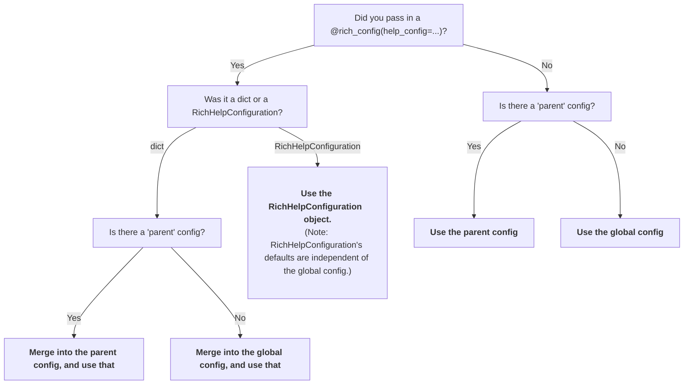

# Configuration

There are two methods to configure **rich-click**:

- Decorator: Use the `@rich_config()` decorator (and `RichHelpConfiguration()`).
- Globals: Set the global variables in the `rich_config.rich_config` module.

## Configuration using the `rich_config` decorator

Initializing a new `RichHelpConfiguration` object creates a configuration that you can then pass to your CLIs via the `rich_config` decorator. For example:

```python
import rich_click as click

@click.command()
@click.rich_config(help_config=click.RichHelpConfiguration(style_option="bold red"))
def cli():
    """Help text here."""

cli()
```

`RichHelpConfiguration()` initializes the default configuration, and the user is able to specify any changes to that default configuration that they'd like. Note that `RichHelpConfiguration()` is unaware of the global configuration.

You may also specify custom config as a dict:

```python
import rich_click as click
from rich_click import rich_config

@click.command()
@rich_config(help_config={"style_option": "bold red"})
def cli():
    """Help text here."""

cli()
```

There is a subtle difference between using a `dict` and using a `RichHelpConfiguration`. Initializing a `RichHelpConfiguration` creates a fresh config from the defaults, whereas a `dict` merges to either the parent or (if the parent config does not exist) the global config.

In the below example `subcommand`'s configuration would get "merged" into `my_group`'s configuration, meaning that `subcommand` would inherit the `style_option="bold red"` style from `my_group`:

```python
import rich_click as click
from rich_click import rich_config

@click.group()
@rich_config(help_config={"style_option": "bold red"})
def my_group():
    """Help text here."""

@my_group.command()
@rich_config(help_config={"style_argument": "bold yellow"})
def subcommand():
    """Help text here."""

cli()
```

## Configuration using the global config

The other way to configure rich-click is to use the global configuration inside the `rich_click.rich_click` module:

```python
import rich_click as click
import rich_click.rich_click as rc

rc.STYLE_OPTION = "bold red"

@click.command()
def my_command():
    """Help text here."""

cli()
```

## Compatibility between `RichHelpConfiguration` and global config

You can load the global config into a `RichHelpConfiguration` using the `RichHelpConfiguration.load_from_globals()` classmethod:

```python
import rich_click as click
import rich_click.rich_click as rc

rc.STYLE_OPTION = "bold red"

# The help config will have `style_option = "bold red"`.
help_config = click.RichHelpConfiguration.load_from_globals()

@click.command()
@click.rich_config(help_config=help_config)
def my_command():
    """Help text here."""

cli()
```

You can also dump a help config into the global config using `RichHelpConfiguration().dump_to_globals()`.
You probably do not need this in most cases; this is mostly for **rich-click**'s internal use.

```python
import rich_click as click
import rich_click.rich_click as rc

help_config = click.RichHelpConfiguration(style_option="bold red")
help_config.dump_to_globals()

# The CLI will have `style_option = "bold red"` since it pulls from the globals.
@click.command()
def my_command():
    """Help text here."""

cli()
```


## Configuration options

Below is a full list of configuration options from `rich_click.py`.

??? info "Config"
    ```python
    
    ```

All of these are available in the `RichHelpConfiguration` object, but as lowercase.

## Config resolution order (advanced)

It probably should not matter for most use cases, but just case it does matter, there is an explicitly defined order of operations for how the configuration gets resolved:


