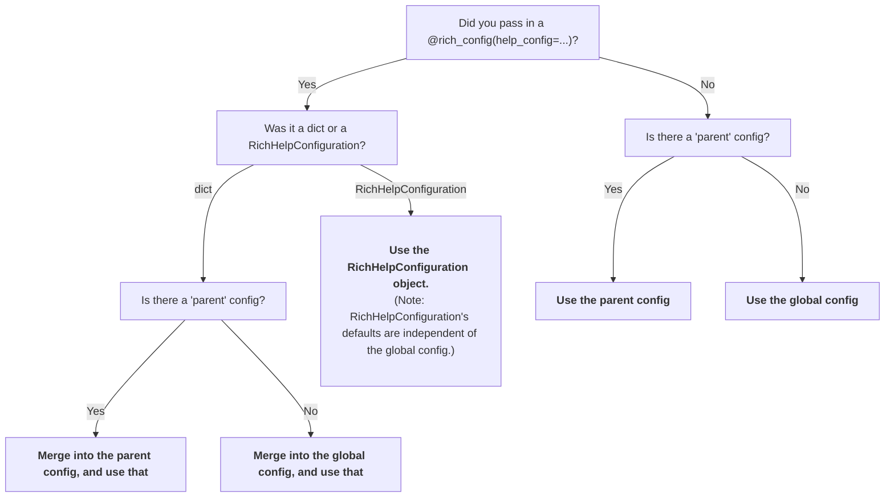

# Configuration

There are two methods to configure **rich-click**:

- Decorator: Use the `@rich_config()` decorator (and `RichHelpConfiguration()`).
- Globals: Set the global variables in the `rich_config.rich_config` module.

## Configuration using the `rich_config` decorator

Initializing a new `RichHelpConfiguration` object creates a configuration that you can then pass to your CLIs via the `rich_config` decorator. For example:

```python
import rich_click as click

@click.command()
@click.rich_config(help_config=click.RichHelpConfiguration(style_option="bold red"))
def cli():
    """Help text here."""
```

`RichHelpConfiguration()` initializes the default configuration, and the user is able to specify any changes to that default configuration that they'd like. Note that `RichHelpConfiguration()` is unaware of the global configuration.

You may also specify custom config as a dict:

```python
import rich_click as click
from rich_click import rich_config

@click.command()
@rich_config(help_config={"style_option": "bold red"})
def cli():
    """Help text here."""
```

There is a subtle difference between using a `dict` and using a `RichHelpConfiguration`.
Initializing a `RichHelpConfiguration` creates a fresh config from the defaults, whereas a `dict` merges to either the parent or (if the parent config does not exist) the global config.

In the below example `subcommand`'s configuration would get "merged" into `my_group`'s configuration, meaning that `subcommand` would inherit the `style_option="bold red"` style from `my_group`:

```python
import rich_click as click
from rich_click import rich_config

@click.group()
@rich_config(help_config={"style_option": "bold red"})
def my_group():
    """Help text here."""

@my_group.command()
@rich_config(help_config={"style_argument": "bold yellow"})
def subcommand():
    """Help text here."""
```

## Configuration using the global config

The other way to configure rich-click is to use the global configuration inside the `rich_click.rich_click` module:

```python
import rich_click as click
import rich_click.rich_click as rc

rc.STYLE_OPTION = "bold red"

@click.command()
def my_command():
    """Help text here."""
```

## Compatibility between `RichHelpConfiguration` and global config

You can load the global config into a `RichHelpConfiguration` using the `RichHelpConfiguration.load_from_globals()` classmethod:

```python
import rich_click as click
import rich_click.rich_click as rc

rc.STYLE_OPTION = "bold red"

# The help config will have `style_option = "bold red"`.
help_config = click.RichHelpConfiguration.load_from_globals()

@click.command()
@click.rich_config(help_config=help_config)
def my_command():
    """Help text here."""
```

You can also dump a help config into the global config using `RichHelpConfiguration().dump_to_globals()`.
You probably do not need this in most cases; this is mostly for **rich-click**'s internal use.

```python
import rich_click as click
import rich_click.rich_click as rc

help_config = click.RichHelpConfiguration(style_option="bold red")
help_config.dump_to_globals()

# The CLI will have `style_option = "bold red"` since it pulls from the globals.
@click.command()
def my_command():
    """Help text here."""
```

## Themes

!!! success
    This section is specifically concerned with how themes interact with configurations.

    More general information about themes is described in [the **themes** docs](themes.md).

Config options controlled by themes are assigned a sentinel value.
When a `RichHelpConfiguration()` object is created, if the `theme` is defined, then the theme is applied to any **unset** config values.
If the theme is not defined, then those values are kept as unset.
When the `RichHelpFormatter()` object is created, if there is still no theme, then the default theme (`default-box`) is applied.

In the event that there are multiple themes being assigned from different sources, one theme must be selected. The priority order of which theme gets selected is defined below (highest priority is #1):

1. The theme defined in the `rich-click` CLI: `rich-click --theme [theme]`
2. Environment variable: `RICH_CLICK_THEME=[theme]`
3. The `theme` of the command's config

Do note that other than end-user overrides and being applied last to unset values, other rules still apply with config resolution.
So for example, the below will not apply the `"green2-nu"` theme to the CLI:

=== "Bad example"
    ```python
    import rich_click as click
    import rich_click.rich_click as rc
    
    # This will NOT work because the RichHelpConfiguration() below
    # completely ignores the the global config.

    rc.THEME = "green2-nu"
    
    help_config = click.RichHelpConfiguration(style_option="magenta")
    
    @click.command()
    @click.rich_config(help_config=help_config)
    def my_command():
        """Help text here."""
    ```

=== "Fix 1a"
    ```python
    import rich_click as click

    @click.command()
    @click.rich_config({"theme": "green2-nu", "style_option": "magenta"})
    def my_command():
        """Help text here."""
    ```

=== "Fix 1b"
    ```python
    import rich_click as click

    @click.command()
    @click.rich_config(click.RichHelpConfiguration(theme="green2-nu", style_option="magenta"))
    def my_command():
        """Help text here."""
    ```

=== "Fix 1c"
    ```python
    import rich_click as click
    import rich_click.rich_click as rc

    rc.THEME = "green2-nu"
    rc.STYLE_OPTION = "magenta"

    @click.command()
    def my_command():
        """Help text here."""
    ```

=== "Fix 2"
    ```python
    import rich_click as click
    import rich_click.rich_click as rc
    
    # This works because of the config rule that dicts get merged
    # into the global config

    rc.THEME = "green2-nu"

    @click.command()
    @click.rich_config({"style_option": "magenta"})
    def my_command():
        """Help text here."""
    ```

### Handling overrides and custom themes

The user can override the theme that a developer sets because all end-user settings (CLI and env var) are prioritized above things set by the developer (command config).

Note that themes never override existing config options, so explicitly set options always take precedence over a theme. This can cause potentially unintended side effects where your style settings clash with the user's theme. There are three ways around this.

The first is to **do nothing**. For many config options, like `commands_before_options` or `options_panel_title`, the theme should not make any real difference or the config option may not even be stylistic in nature. Theme overrides only become a real issue when a user's `RICH_CLICK_THEME` clashes stylistically with your custom settings.

The second way is to **explicitly prevent theme overrides** by setting the config option `enable_theme_env_var = False`. This option prevents **all** overrides when enabled.

=== "`{}`"

    ```python
    import rich_click as click
    
    @click.group("cli")
    @click.rich_config({"theme": "nord-slim", "enable_theme_env_var": False})
    def cli():
        """My CLI help text"""
    ```

=== "`RichHelpConfiguration()`"
    ```python
    import rich_click as click
    
    @click.group("cli")
    @click.rich_config(click.RichHelpConfiguration(theme="nord-slim", enable_theme_env_var=False))
    def cli():
        """My CLI help text"""
    ```

=== "Global config"
    ```python
    import rich_click as click

    click.rich_click.THEME = "nord-slim"
    click.rich_click.ENABLE_THEME_ENV_VAR = False

    @click.group("cli")
    def cli():
        """My CLI help text"""
    ```

The final way is to **apply your config as a theme**.
Basically, since themes are applied last and can be overridden, then if you have your config applied as a theme, then it can be overridden. RichHelpConfigurations have a method called to_theme which generates a theme from your config:

```python
import rich_click as click

config = click.RichHelpConfiguration()
theme = config.to_theme()

@click.group("cli")
# This can be overridden.
@click.rich_config({"theme": theme})
def cli():
    """My CLI help text"""
```

A more advanced pattern, which lets you make some options overridable by a theme, while keeping others immutable:

```python
import rich_click as click

# All of these config options can be overridden
theme = click.RichHelpConfiguration(
    style_option="bold red",
    style_command="bold green"
).to_theme()

# Here, `style_metavar` will not be overridden by the RICH_CLICK_THEME env var.
config = click.RichHelpConfiguration(
    theme=theme,
    style_metavar="magenta",
)

@click.group("cli")
@click.rich_config(config)
def cli():
    """My CLI help text"""
```

## Configuration options

Below is a full list of configuration options from `rich_click.py`.

??? info "Config"
    ```python
    
    ```

All of these are available in the `RichHelpConfiguration` object, but as lowercase.

## Config resolution order (advanced)

It probably should not matter for most use cases, but just case it does matter, there is an explicitly defined order of operations for how the configuration gets resolved:


