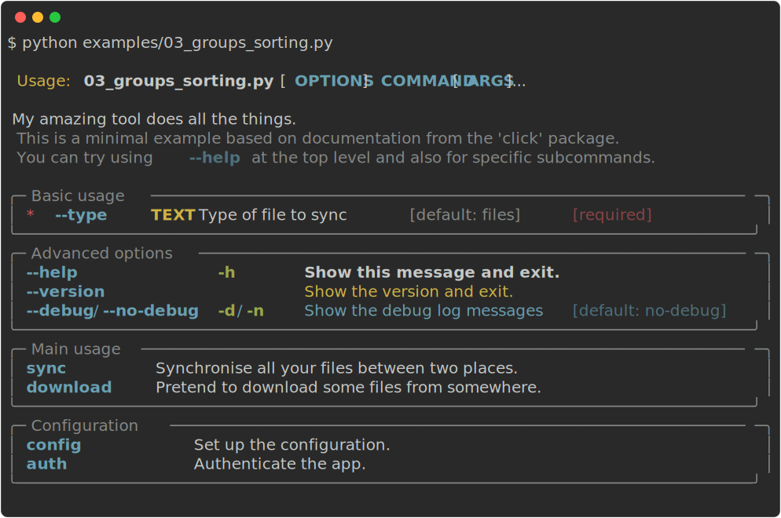

# Groups & Sorting

**rich-click** gives functionality to list options and subcommands in groups, printed as separate panels.
It accepts a list of options / commands which means you can also choose a custom sorting order.

- For options / flags, set `click.rich_click.OPTION_GROUPS`
- For subcommands / Click groups, set `click.rich_click.COMMAND_GROUPS`



When grouping subcommands into more than one group (in above example: 'Main usage' and 'Configuration') you may find that the automatically calculated widths of different groups do not line up, due to varying option name lengths.

You can avoid this by enforcing the alignment of the help text across groups by setting `click.rich_click.STYLE_COMMANDS_TABLE_COLUMN_WIDTH_RATIO = (1, 2)`. This results in a fixed ratio of 1:2 for the width of command name and help text column.

!!! info
    See [`examples/03_groups_sorting.py`](https://github.com/ewels/rich-click/blob/main/examples/03_groups_sorting.py) for a full example.

## Options

To group option flags into two sections with custom names, see the following example:

```python
click.rich_click.OPTION_GROUPS = {
    "mytool": [
        {
            "name": "Simple options",
            "options": ["--name", "--description", "--version", "--help"],
        },
        {
            "name": "Advanced options",
            "options": ["--force", "--yes", "--delete"],
        },
    ]
}
```

If you omit `name` it will use `Commands` (can be configured with `OPTIONS_PANEL_TITLE`).

## Commands

Here we create two groups of commands for the base command of `mytool`.
Any subcommands not listed will automatically be printed in a panel at the end labelled "Commands" as usual.

```python
click.rich_click.COMMAND_GROUPS = {
    "mytool": [
        {
            "name": "Commands for uploading",
            "commands": ["sync", "upload"],
        },
        {
            "name": "Download data",
            "commands": ["get", "fetch", "download"],
        },
    ]
}
```

If you omit `name` it will use `Commands` (can be configured with `COMMANDS_PANEL_TITLE`).

## Multiple commands

If you use multiple nested subcommands, you can specify their commands using the top-level dictionary keys:

```python
click.rich_click.COMMAND_GROUPS = {
    "mytool": [{"commands": ["sync", "auth"]}],
    "mytool sync": [
        {
            "name": "Commands for uploading",
            "commands": ["sync", "upload"],
        },
        {
            "name": "Download data",
            "commands": ["get", "fetch", "download"],
        },
    ],
    "mytool auth": [{"commands": ["login", "logout"]}],
}
```

## Wildcard options

Instead of defining the group based on the command path, you can use wildcards instead:

```python
click.rich_click.COMMAND_GROUPS = {
    "*": [
        {
            "name": "Commands for entity management",
            "commands": ["user", "item"],
        }
    ]
}

click.rich_click.OPTION_GROUPS = {
    "*": [
        {
            "name": "Simple options",
            "options": ["--name", "--description"],
        },
    ],
    # This will match to all subcommands of "user", e.g. "cli user create" and "cli user update".
    "cli user *": [
        {
            "name": "Cloud",
            "options": ["--region", "--env"],
        },
    ],
    # This will match to things like "cli user delete" and "cli item delete".
    "cli * delete": [
        {
            "name": "Advanced",
            "options": ["--force"],
        },
    ],
}
```

This will apply the groups to every subcommand of the command group.
If a command or option specified in the wildcard does not exist, then it is ignored.
Using the above code as an example, imagine the command `cli user describe` does not have an option `--environment`.
It would still be safe in that case to map `--environment` to `cli user *`; it will just be ignored.

If an option is specified for both a wildcard and explicitly named command, then the wildcard is ignored;
explicit naming always takes precedence.

!!! warning
    **rich-click** does its best to attempt to resolve duplicate options/command definitions, but other than
    preferring exact matches  to wildcards, the exact logic of how duplicates are resolved is subject to
    revision in upcoming minor version releases. Don't get too clever with duplicating your options/commands!

## Styling

Typically, you would style the option / command tables using the global config options.
However, if you wish, you may style tables on a per-group basis using the `table_styles` and `panel_styles` keys:

```python
click.rich_click.COMMAND_GROUPS = {
    "mytool": [
        {
            "commands": ["sync", "auth"],
            "table_styles": {
                "show_lines": True,
                "row_styles": ["magenta", "yellow", "cyan", "green"],
                "border_style": "red",
                "box": "DOUBLE",
            },
            "panel_styles": {
                "box": "ASCII",
            }
        },
    ],
}
```

The `table_styles` dict is pass as kwargs into the inner `rich.table.Table()`, and `panel_styles` is passed into the outer `rich.panel.Panel()`.

You can view the respective docstrings of the `Table` and `Panel` objects for more information:

- [`rich/table.py`](https://github.com/Textualize/rich/blob/master/rich/table.py)
- [`rich/panel.py`](https://github.com/Textualize/rich/blob/master/rich/panel.py)

### Argument Styles

The panel for positional arguments is a little special.

If the following three things are true...:

1. `config.show_arguments` is `True`.
2. There is an option group with a `name` equal to the `config.arguments_panel_title` (default: `'Arguments'`)
3. The option group does not have any `options` (The list is empty, undefined, or `None`).

... Then this allows you to specify styling options for the `Arguments` panel separately of other panels.

For example, in the below code, the `Arguments` panel will have a box type of `ASCII`,
independent of the options panel.

```python
import rich_click as click

help_config = click.RichHelpConfiguration(
    show_arguments=True,
    option_groups={"my-command": [{"name": "Arguments", "panel_styles": {"box": "ASCII"}}]}
)

@click.command
@click.argument("foo")
@click.option("--bar")
@click.rich_config(help_config=help_config)
def cli(foo, bar):
    ...
```

## Usage notes

Be careful implementing command/option groups with `@click.rich_config(help_config=...)` in subcommands:
    - The groups are _**not**_ merged to the parent help config.
    - It is _**still required**_ to spell out the whole command as the key, or at least match with a wildcard.

For example, the following code works:

```python
@click.group("my-cli")
def my_cli():
  ...

# This example uses `"*my-subcommand"` to enable it to map to any arbitrarily named parent command.
@my_cli.command("my-subcommand")
@click.option("--version")
@click.rich_config(help_config={"option_groups": {"*my-subcommand": [{"name": "Version", "commands": ["--version"]}]}})
def my_subcommand():
  ...
```

However, if you were to only specify `"my-subcommand"`

!!! info
    The reason why specifying option/command groups is like this has to do with **rich-click**'s history.
    Basically, the `@click.rich_config()` decorator and `RichHelpConfiguration()` object were not introduced until version 1.7.0.
    Prior to that, the only way to define config options was with the global configuration.

    So, the way that `option_groups` and `command_groups` are defined is a relic of **rich-click**'s global configuration.
    **rich-click**'s maintainers are aware of how awkward it feels, and we'll be introducing a more seamless and natural API in a future release. 😊
