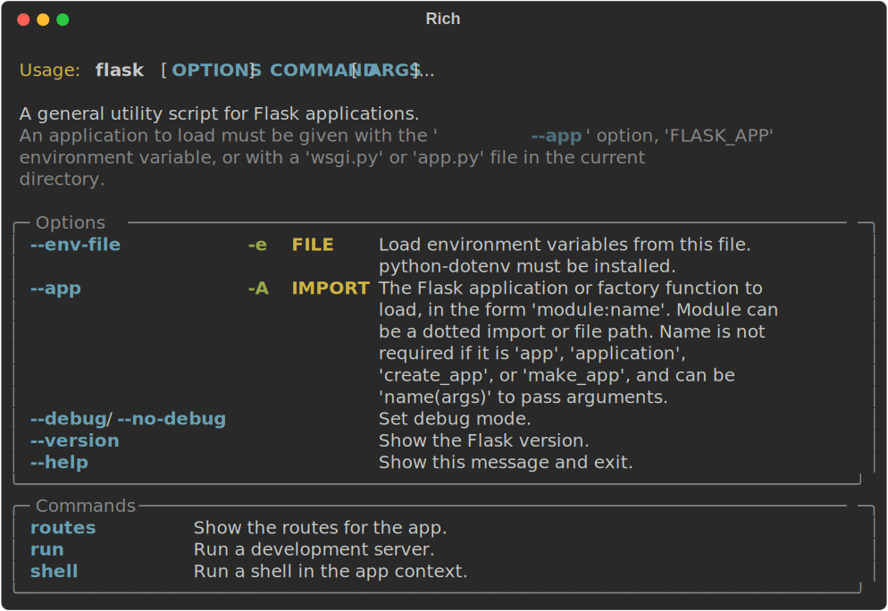
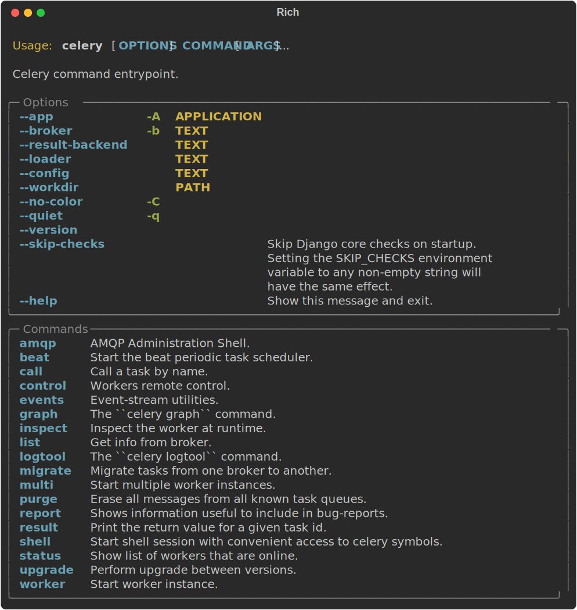
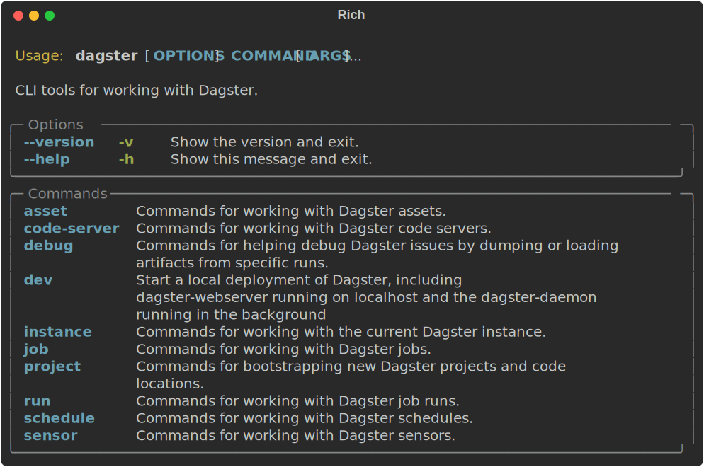

# `rich-click` CLI tool

## Overview

**rich-click** comes with a CLI tool that allows you to format the Click help output for any CLI that uses Click.

<!-- RICH-CODEX
head: 12
-->
{.screenshot}

To use, simply prefix `rich-click` to the command. Here are a few real world examples:

=== "`flask`"

    {.screenshot}

=== "`celery`"

    {.screenshot}

=== "`dagster`"

    {.screenshot}

If the CLI is not installed as a script, you can also pass the location with: `<module_name>:<click_command_name>`.

For example, if you have a file located at `path/to/my/cli.py`, and the Click `Command` object is named `main`, then you can run: `rich-click path.to.my.cli:main`.

!!! warning

    If you are experiencing any unexpected issues with the `rich-click` CLI, first make sure you are not calling
    your command on load of the module.

    For example, the following could cause a strange `No such option: --output` error when attempting to run `rich-click --output html my_cli:cli`:

    ```python
    import rich_click as click
    
    @click.command("my-cli")
    @click.argument("x")
    def cli(x):
        ...

    cli()
    ```

    To make it so `rich-click --output html` works on the above code, add a `if __name__ == "__main__":`

    ```python hl_lines="8"
    import rich_click as click
    
    @click.command("my-cli")
    @click.argument("x")
    def cli(x):
        ...
    
    if __name__ == "__main__":
        cli()
    ```


## Render help text as HTML or SVG

You can also use `rich-click --output=html [command]` to render rich HTML for help text, or `rich-click --output=svg [command]` to generate an SVG.

This works for RichCommands as well as normal click Commands.

SVG example:

<!-- RICH-CODEX
extra_env:
  PYTHONPATH: .
fake_command: rich-click --output svg app:main --help
working_dir: docs/code_snippets/rich_click_cli
head: 12
-->
{.screenshot}

HTML example:

<!-- RICH-CODEX
extra_env:
  PYTHONPATH: .
fake_command: rich-click --output html app:main --help
working_dir: docs/code_snippets/rich_click_cli
head: 12
-->
{.screenshot}

_SVG and HTML generated from [`docs/code_snippets/rich_click_cli/app.py`](https://github.com/ewels/rich-click/blob/main/docs/code_snippets/rich_click_cli/app.py)_

## Notes on how the `rich-click` CLI works

Under the hood, the `rich-click` CLI is patching the `click` module, and replacing the Click decorators and `click.Command`, `click.Group`, etc. objects with their equivalent **rich-click** versions.

Sometimes, a subclassed `click.Command` will overwrite one of these methods:

- `click.Command.format_usage`
- `click.Command.format_help_text`
- `click.Command.format_options`
- `click.MultiCommand.format_commands`
- `click.Command.format_epilog`

Patching Click internals can mess with method resolution order,
since by the time the downstream library subclasses the `click.Command`, it will be a `RichCommand`, and the subclass's method will take precedence over the `RichCommand`'s methods.
The problem is that **rich-click**'s methods can be incompatible or at least stylistically incongruous with the base Click help text rendering.

To solve this, `rich-click` checks whether a method comes from a "true" `RichCommand` subclass or if it just looks that way due to patching.
If `RichCommand` is "properly" subclassed, the override is allowed.
If the subclass is only a result of the patching operation, we ignore the aforementioned methods and use the **rich-click** implementation.

Long story short, the `rich-click` CLI is safe to subclassing when it is the user's intent to subclass a **rich-click** object. (This is so that you can use other nifty features of the CLI such as the `--output` option on your own **rich-click** CLIs)
That said, custom, non-**rich-click** implementations are ignored.

### Using `patch()` as an end user

The functionality that `rich-click` uses to patch Click internals is available for use by **rich-click** end users,
and it occasionally comes in handy outside of the `rich-click` CLI.

In some situations, you might be registering a command from another Click CLI that does not use **rich-click**:

```python
import rich_click as click
from some_library import another_cli

@click.group("my-cli")
def cli():
    pass

# `another_cli` will NOT have rich-click markup. :(
cli.add_command(another_cli)
```

In this situation, `another_cli` retains its original help text behavior.
In order to make `another_cli` work with **rich-click**, you need to patch `click` before you import `another_cli`.
You can patch Click with `rich_click.patch.patch` like this:

```python
import rich_click as click
from rich_click.patch import patch

patch()

from some_library import another_cli  # noqa: E402

@click.group("my-cli")
def cli():
    pass

# `another_cli` will have rich-click markup. :)
cli.add_command(another_cli)
```
