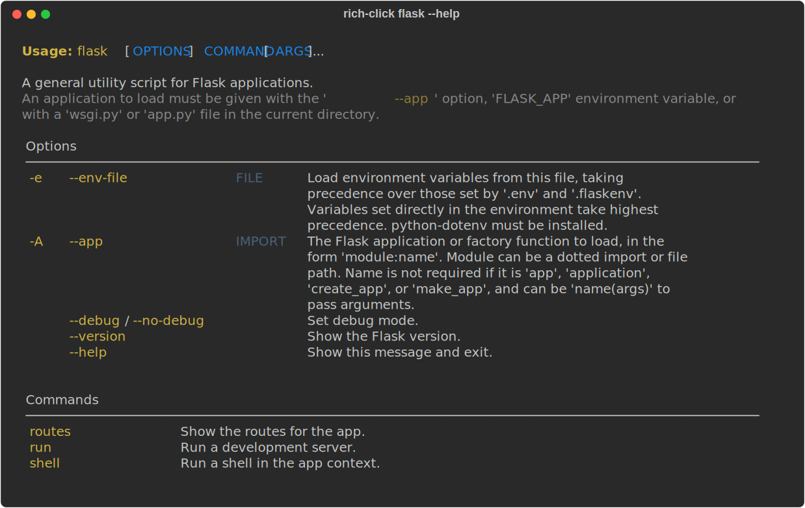
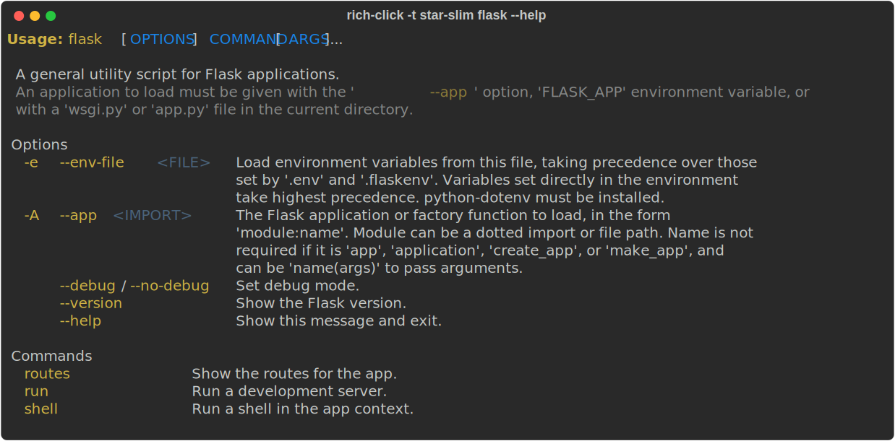
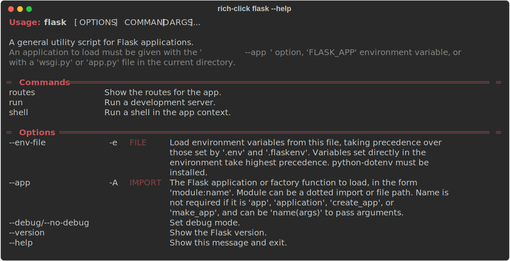
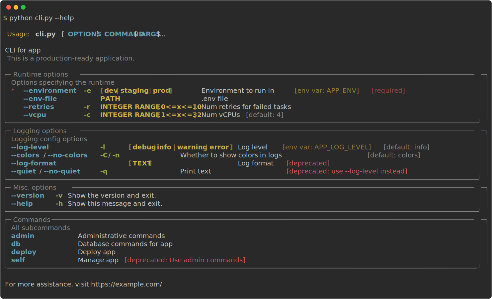

# Themes

**Themes** are a simple way to customize the style of CLI help text as both an end-user and as a developer.
Themes are one of **rich-click**'s most powerful features.

=== "`nord-nu`"

    ```shell
    export RICH_CLICK_THEME=nord-nu
    python docs/code_snippets/themes/cli.py --help
    ```

    <!-- RICH-CODEX
    working_dir: docs/code_snippets/themes
    extra_env:
        TERMINAL_WIDTH: 120
        RICH_CLICK_THEME: '{"theme": "nord-nu", "color_system": "truecolor"}'
    -->

    {.screenshot}

=== "`dracula-modern`"

    ```shell
    export RICH_CLICK_THEME=dracula-modern
    python docs/code_snippets/themes/cli.py --help
    ```

    <!-- RICH-CODEX
    working_dir: docs/code_snippets/themes
    extra_env:
        TERMINAL_WIDTH: 120
        RICH_CLICK_THEME: '{"theme": "dracula-modern", "color_system": "truecolor"}'
    -->
    {.screenshot}

=== "`cargo-slim`"

    ```shell
    export RICH_CLICK_THEME=cargo-slim
    python docs/code_snippets/themes/cli.py --help
    ```

    <!-- RICH-CODEX
    working_dir: docs/code_snippets/themes
    extra_env:
        TERMINAL_WIDTH: 120
        RICH_CLICK_THEME: cargo-slim
    -->
    {.screenshot}

=== "`forest-robo`"

    ```shell
    export RICH_CLICK_THEME=forest-robo
    python docs/code_snippets/themes/cli.py --help
    ```

    <!-- RICH-CODEX
    working_dir: docs/code_snippets/themes
    extra_env:
        TERMINAL_WIDTH: 120
        RICH_CLICK_THEME: forest-robo
    -->
    {.screenshot}

Themes consist of **Color Palettes** and **Formats**, which can be mixed and matched.
The name of a full theme has the following schema: `{color_palette}-{format}`.

For example, the **forest-slim** theme uses the **forest** color palette and the **slim** format.

??? info "Code for `cli.py`"

    The following CLI code is used throughout this module to show off themes.

    ```python
    
    ```

## Themes as an end-user

Unless a developer specifies otherwise, every **rich-click** CLI can have a theme applied by an end-user by setting the `RICH_CLICK_THEME` env var.

If you'd like to set a global theme, add the following to your shell's config file (replacing `star-modern` with whatever theme you desire):

=== "bash"
    ```shell
    echo "export RICH_CLICK_THEME=star-modern" >> ~/.bashrc
    ```

=== "zsh"
    ```shell
    echo "export NO_COLOR=1" >> ~/.zshrc
    ```

Themes will also be used when you wrap a base Click CLI in the `rich-click` CLI, e.g.:

=== "Command"
    ```shell
    export RICH_CLICK_THEME=star-modern
    rich-click flask --help
    ```
=== "uv command"
    ```shell
    export RICH_CLICK_THEME=star-modern
    uv run --with=flask --with=rich-click \
        rich-click flask --help
    ```

{.screenshot}

Alternatively, when using the `rich-click [cmd]` CLI, you can pass a theme via the `--theme`/`-t` option:

=== "Command"
    ```shell
    rich-click -t star-slim flask --help
    ```
=== "uv command"
    ```shell
    uv run --with=flask --with=rich-click \
        rich-click --theme=star-slim flask --help
    ```

{.screenshot}

The `RICH_CLICK_THEME` env var can also be a full JSON representation of a config.
For example, let's say you prefer having commands above options. There is a config option for this, `commands_before_options`, and you can place that in the `RICH_CLICK_THEME` env var:

=== "Command"
    ```shell
    export RICH_CLICK_THEME='{"commands_before_options": true, "theme": "red1-nu"}'
    rich-click flask --help
    ```
=== "uv command"
    ```shell
    export RICH_CLICK_THEME='{"commands_before_options": true, "theme": "red1-nu"}'
    uv run --with=flask --with=rich-click \
        rich-click flask --help
    ```

{.screenshot}

## Themes as a developer

You can set a theme for your CLI by setting it in the config:

=== "`{}`"

    ```python
    import rich_click as click
    
    @click.group("cli")
    @click.rich_config({"theme": "nord-slim"})
    def cli():
        """My CLI help text"""
    ```

=== "`RichHelpConfiguration()`"
    ```python
    import rich_click as click
    
    @click.group("cli")
    @click.rich_config(click.RichHelpConfiguration(theme="nord-slim"))
    def cli():
        """My CLI help text"""
    ```

=== "Global config"
    ```python
    import rich_click as click

    click.rich_click.THEME = "nord-slim"

    @click.group("cli")
    def cli():
        """My CLI help text"""
    ```

For more advanced CLIs, with lots of other customization options, there are additional considerations with themes and how they interact with your config that you may want to consider, especially in relation to end users being able to override the theme. For more information on this, read [the **Configuration** docs](configuration.md).

## All themes

### Formats

There are currently 5 available **formats**.

=== "`box`"
    **(Default)** Original rich-click format with boxes.

    <!-- RICH-CODEX
    working_dir: docs/code_snippets/themes
    extra_env:
        TERMINAL_WIDTH: 120
        RICH_CLICK_THEME: default-box
    -->
    {.screenshot}

=== "`slim`"
    Simple, classic, no-fuss CLI format.

    <!-- RICH-CODEX
    working_dir: docs/code_snippets/themes
    extra_env:
        TERMINAL_WIDTH: 120
        RICH_CLICK_THEME: default-slim
    -->
    {.screenshot}

=== "`modern`"
    Beautiful modern look.

    <!-- RICH-CODEX
    working_dir: docs/code_snippets/themes
    extra_env:
        TERMINAL_WIDTH: 120
        RICH_CLICK_THEME: default-modern
    -->
    {.screenshot}

=== "`robo`"
    Spacious with sharp corners.

    <!-- RICH-CODEX
    working_dir: docs/code_snippets/themes
    extra_env:
        TERMINAL_WIDTH: 120
        RICH_CLICK_THEME: default-robo
    -->
    {.screenshot}

=== "`nu`"
    Great balance of compactness, legibility, and style.

    <!-- RICH-CODEX
    working_dir: docs/code_snippets/themes
    extra_env:
        TERMINAL_WIDTH: 120
        RICH_CLICK_THEME: default-nu
    -->
    {.screenshot}

### Color palettes

There are currently over a dozen different **color palettes**.

#### Multi-colored palettes

=== "`default`"
    **Default** Original rich-click colors.

    ```shell
    export RICH_CLICK_THEME=default-box
    python docs/code_snippets/themes/cli.py --help
    ```

    {.screenshot}

=== "`solarized`"
    Bright, colorful, vibrant accents.

    ```shell
    export RICH_CLICK_THEME=solarized-box
    python docs/code_snippets/themes/cli.py --help
    ```

    <!-- RICH-CODEX
    working_dir: docs/code_snippets/themes
    extra_env:
        TERMINAL_WIDTH: 120
        RICH_CLICK_THEME: '{"theme": "solarized-box", "color_system": "truecolor"}'
    -->
    {.screenshot}

=== "`nord`"
    Many shades of cool colors.

    ```shell
    export RICH_CLICK_THEME=nord-box
    python docs/code_snippets/themes/cli.py --help
    ```

    <!-- RICH-CODEX
    working_dir: docs/code_snippets/themes
    extra_env:
        TERMINAL_WIDTH: 120
        RICH_CLICK_THEME: '{"theme": "nord-box", "color_system": "truecolor"}'
    -->
    {.screenshot}

=== "`star`"
    Litestar theme; royal feel.

    ```shell
    export RICH_CLICK_THEME=star-box
    python docs/code_snippets/themes/cli.py --help
    ```

    <!-- RICH-CODEX
    working_dir: docs/code_snippets/themes
    extra_env:
        TERMINAL_WIDTH: 120
        RICH_CLICK_THEME: star-box
    -->
    {.screenshot}

=== "`quartz`"
    Dark and radiant.

    ```shell
    export RICH_CLICK_THEME=quartz-box
    python docs/code_snippets/themes/cli.py --help
    ```

    <!-- RICH-CODEX
    working_dir: docs/code_snippets/themes
    extra_env:
        TERMINAL_WIDTH: 120
        RICH_CLICK_THEME: quartz-box
    -->
    {.screenshot}

=== "`quartz2`"
    Remix of 'quartz' with accents.

    ```shell
    export RICH_CLICK_THEME=quartz2-box
    python docs/code_snippets/themes/cli.py --help
    ```

    <!-- RICH-CODEX
    working_dir: docs/code_snippets/themes
    extra_env:
        TERMINAL_WIDTH: 120
        RICH_CLICK_THEME: quartz2-box
    -->
    {.screenshot}

=== "`cargo`"
    Cargo CLI theme; legible and bold.

    ```shell
    export RICH_CLICK_THEME=cargo-box
    python docs/code_snippets/themes/cli.py --help
    ```

    <!-- RICH-CODEX
    working_dir: docs/code_snippets/themes
    extra_env:
        TERMINAL_WIDTH: 120
        RICH_CLICK_THEME: cargo-box
    -->
    {.screenshot}

=== "`forest`"
    Earthy tones with analogous colors.

    ```shell
    export RICH_CLICK_THEME=forest-box
    python docs/code_snippets/themes/cli.py --help
    ```

    <!-- RICH-CODEX
    working_dir: docs/code_snippets/themes
    extra_env:
        TERMINAL_WIDTH: 120
        RICH_CLICK_THEME: forest-box
    -->
    {.screenshot}

=== "`dracula`"
    Vibrant high-contract dark theme.

    ```shell
    export RICH_CLICK_THEME=dracula-box
    python docs/code_snippets/themes/cli.py --help
    ```

    <!-- RICH-CODEX
    working_dir: docs/code_snippets/themes
    extra_env:
        TERMINAL_WIDTH: 120
        RICH_CLICK_THEME: '{"theme": "dracula-box", "color_system": "truecolor"}'
    -->
    {.screenshot}

!!! warning
    The `dracula`, `nord`, and `solarized` themes use hex values,
    and **rich-click** currently does not detect background colors for users' terminals.

    So although these themes are beautiful and work well as an end-user with `export RICH_CLICK_THEME=`, this also makes these themes risky to use as a developer.

    All of the other themes use ANSI colors exclusively, and therefore users' environments are more likely to match these themes well.

    The `dracula`, `nord`, and `solarized` all have variants that force dark-backgrounds: `dracula_darkbg`, `nord_darkbg`, and `solarized_darkbg`.
    We recommend applying this with something like [`term-background`](https://pypi.org/project/term-background/):

    ```python
    import rich_click as click
    from term_background import is_dark_background

    if is_dark_background():
        click.rich_click.THEME = "nord"
    else:
        click.rich_click.THEME = "nord_darkbg"
    ```

    Additionally, the `solarized` theme in particular is quite legible on both dark and light backgrounds,
    so it is a relatively safe theme to use as a developer.

    In a later version of **rich-click**, we intend on adding background color detection and styling conditional on background color,
    which will make these themes safe to use as a developer.

#### Simple palettes

The following palettes all focus on just a single color.

The below palettes are presented with the `modern` format.

=== "`red1`"
    Simple theme with red accents on section headers.

    ```shell
    export RICH_CLICK_THEME=red1-modern
    python docs/code_snippets/themes/cli.py --help
    ```

    <!-- RICH-CODEX
    working_dir: docs/code_snippets/themes
    extra_env:
        TERMINAL_WIDTH: 120
        RICH_CLICK_THEME: red1-modern
    -->
    {.screenshot}

=== "`red2`"
    Simple theme with red accents on object names.

    ```shell
    export RICH_CLICK_THEME=red2-modern
    python docs/code_snippets/themes/cli.py --help
    ```

    <!-- RICH-CODEX
    working_dir: docs/code_snippets/themes
    extra_env:
        TERMINAL_WIDTH: 120
        RICH_CLICK_THEME: red2-modern
    -->
    {.screenshot}

=== "`green1`"
    Simple theme with green accents on section headers.

    ```shell
    export RICH_CLICK_THEME=green1-modern
    python docs/code_snippets/themes/cli.py --help
    ```

    <!-- RICH-CODEX
    working_dir: docs/code_snippets/themes
    extra_env:
        TERMINAL_WIDTH: 120
        RICH_CLICK_THEME: green1-modern
    -->
    {.screenshot}

=== "`green2`"
    Simple theme with green accents on object names.

    ```shell
    export RICH_CLICK_THEME=green2-modern
    python docs/code_snippets/themes/cli.py --help
    ```

    <!-- RICH-CODEX
    working_dir: docs/code_snippets/themes
    extra_env:
        TERMINAL_WIDTH: 120
        RICH_CLICK_THEME: green2-modern
    -->
    {.screenshot}

=== "`yellow1`"
    Simple theme with yellow accents on section headers.

    ```shell
    export RICH_CLICK_THEME=yellow1-modern
    python docs/code_snippets/themes/cli.py --help
    ```

    <!-- RICH-CODEX
    working_dir: docs/code_snippets/themes
    extra_env:
        TERMINAL_WIDTH: 120
        RICH_CLICK_THEME: yellow1-modern
    -->
    {.screenshot}

=== "`yellow2`"
    Simple theme with yellow accents on object names.

    ```shell
    export RICH_CLICK_THEME=yellow2-modern
    python docs/code_snippets/themes/cli.py --help
    ```

    <!-- RICH-CODEX
    working_dir: docs/code_snippets/themes
    extra_env:
        TERMINAL_WIDTH: 120
        RICH_CLICK_THEME: yellow2-modern
    -->
    {.screenshot}

=== "`blue1`"
    Simple theme with blue accents on section headers.

    ```shell
    export RICH_CLICK_THEME=blue1-modern
    python docs/code_snippets/themes/cli.py --help
    ```

    <!-- RICH-CODEX
    working_dir: docs/code_snippets/themes
    extra_env:
        TERMINAL_WIDTH: 120
        RICH_CLICK_THEME: blue1-modern
    -->
    {.screenshot}

=== "`blue2`"
    Simple theme with blue accents on object names.

    ```shell
    export RICH_CLICK_THEME=blue2-modern
    python docs/code_snippets/themes/cli.py --help
    ```

    <!-- RICH-CODEX
    working_dir: docs/code_snippets/themes
    extra_env:
        TERMINAL_WIDTH: 120
        RICH_CLICK_THEME: blue2-modern
    -->
    {.screenshot}

=== "`magenta1`"
    Simple theme with magenta accents on section headers.

    ```shell
    export RICH_CLICK_THEME=magenta1-modern
    python docs/code_snippets/themes/cli.py --help
    ```

    <!-- RICH-CODEX
    working_dir: docs/code_snippets/themes
    extra_env:
        TERMINAL_WIDTH: 120
        RICH_CLICK_THEME: magenta1-modern
    -->
    {.screenshot}

=== "`magenta2`"
    Simple theme with magenta accents on object names.

    ```shell
    export RICH_CLICK_THEME=magenta2-modern
    python docs/code_snippets/themes/cli.py --help
    ```

    <!-- RICH-CODEX
    working_dir: docs/code_snippets/themes
    extra_env:
        TERMINAL_WIDTH: 120
        RICH_CLICK_THEME: magenta2-modern
    -->
    {.screenshot}

=== "`cyan1`"
    Simple theme with cyan accents on section headers.

    ```shell
    export RICH_CLICK_THEME=cyan1-modern
    python docs/code_snippets/themes/cli.py --help
    ```

    <!-- RICH-CODEX
    working_dir: docs/code_snippets/themes
    extra_env:
        TERMINAL_WIDTH: 120
        RICH_CLICK_THEME: cyan1-modern
    -->
    {.screenshot}

=== "`cyan2`"
    Simple theme with cyan accents on object names.

    ```shell
    export RICH_CLICK_THEME=cyan2-modern
    python docs/code_snippets/themes/cli.py --help
    ```

    <!-- RICH-CODEX
    working_dir: docs/code_snippets/themes
    extra_env:
        TERMINAL_WIDTH: 120
        RICH_CLICK_THEME: cyan2-modern
    -->
    {.screenshot}


#### Monochromatic palettes

The following palettes have zero color.

=== "`mono`"
    Monochromatic theme with no colors.

    ```shell
    export RICH_CLICK_THEME=mono-box
    python docs/code_snippets/themes/cli.py --help
    ```

    <!-- RICH-CODEX
    working_dir: docs/code_snippets/themes
    extra_env:
        TERMINAL_WIDTH: 120
        RICH_CLICK_THEME: mono-box
    -->
    {.screenshot}

=== "`plain`"
    No style at all.

    ```shell
    export RICH_CLICK_THEME=plain-box
    python docs/code_snippets/themes/cli.py --help
    ```

    <!-- RICH-CODEX
    working_dir: docs/code_snippets/themes
    extra_env:
        TERMINAL_WIDTH: 120
        RICH_CLICK_THEME: plain-box
    -->
    {.screenshot}

??? example "`plain-slim`"
    Of course, the most plain style of them all is `plain-slim`, which renders CLI help text in the most conventional way that **rich-click** can.

    For fun, we've included it here!

    (Or, maybe you really dislike **rich-click**'s styles and you want to add `export RICH_CLICK_THEME=plain-slim` to your `.zshrc`.
    We won't judge!)

    ```shell
    export RICH_CLICK_THEME=plain-slim
    python docs/code_snippets/themes/cli.py --help
    ```

    <!-- RICH-CODEX
    working_dir: docs/code_snippets/themes
    extra_env:
        TERMINAL_WIDTH: 120
        RICH_CLICK_THEME: plain-slim
    -->
    {.screenshot}


### List all themes in command line

Running `rich-click --themes` will provide help text that lists every theme available to you.
The command will also tell you which theme you currently have enabled.

??? info "Output of `rich-click --themes`"

    <!-- RICH-CODEX
    fake_command: rich-click --themes
    terminal_width: 140
    extra_env:
        TERMINAL_WIDTH: 120
        TERMINAL_WIDTH: 140
    -->
    {.screenshot}
