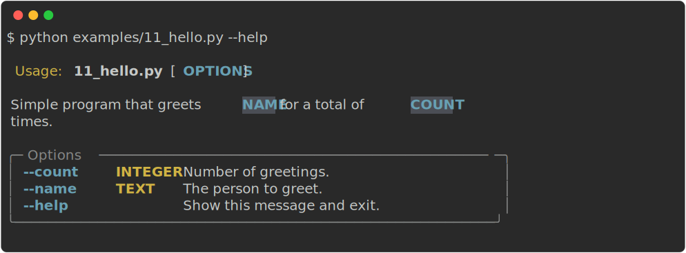

<style>
  .md-typeset h1,
  .md-content__button {
    display: none;
  }
</style>

<p align="center">


</p>
<p align="center">
    <em>Richly rendered command line interfaces in click.</em>
</p>
<p align="center">
    
    
    
</p>

---

<p align="center">
    <a href="https://ewels.github.io/rich-click">Documentation</a>&nbsp&nbsp·&nbsp&nbsp<a href="https://github.com/ewels/rich-click">Source Code</a>&nbsp&nbsp·&nbsp&nbsp<a href="https://github.com/ewels/rich-click">Changelog</a>
</p>

---

**rich-click** is a shim around [Click](https://click.palletsprojects.com/) that renders help output nicely using [Rich](https://github.com/Textualize/rich).

- Click is a _"Python package for creating beautiful command line interfaces"_.
- Rich is a _"Python library for rich text and beautiful formatting in the terminal"_.

The intention of `rich-click` is to provide attractive help output from
Click, formatted with Rich, with minimal customisation required.

## Features

- 🌈 Rich command-line formatting of click help and error messages
- 😌 Same API as Click: usage is simply `import rich_click as click`
- 💫 Nice styles by default
- 💻 CLI tool to run on _other people's_ tools (prefix the command with `rich-click`)
- 📦 Export help text as HTML or SVG
- 🎁 Group commands and options into named panels
- ❌ Well formatted error messages
- 🔢 Easily give custom sort order for options and commands
- 🎨 Extensive customisation of styling and behaviour possible

## Installation

=== "pip"
    ```shell
    pip install rich-click
    ```

=== "uv"
    ```shell
    uv pip install rich-click
    ```

=== "Rye"
    ```shell
    rye add rich-click
    rye sync
    ```

=== "Poetry"
    ```shell
    poetry add rich-click
    ```

=== "Pipenv"
    ```shell
    pipenv install rich-click
    ```

=== "conda"
    ```shell
    conda install rich-click
    ```
    !!! note
        [**rich-click** is available](https://anaconda.org/conda-forge/rich-click) via the conda-forge channel (see [docs](https://conda-forge.org/docs/user/introduction.html#how-can-i-install-packages-from-conda-forge)).

=== "MacPorts"
    ```shell
    sudo port install py-rich-click
    ```

    !!! danger "Depreciated"
        This installation method is deprecated.

## Examples

### Simple example

To use rich-click in your code, replace `import click` with `import rich_click as click` in your existing click CLI:

```python
import rich_click as click

@click.command()
@click.option("--count", default=1, help="Number of greetings.")
@click.option("--name", prompt="Your name", help="The person to greet.")
def hello(count, name):
    """Simple program that greets NAME for a total of COUNT times."""
    for _ in range(count):
        click.echo(f"Hello, {name}!")

if __name__ == '__main__':
    hello()
```

{.screenshot}

### More complex example

**rich-click** has a ton of customisation options that let you compose help text however you'd like.
Below is a more complex example of what **rich-click** is capable of:

{.screenshot}

## Usage

There are a couple of ways to begin using **rich-click**:

### Import `rich_click` as `click`

Switch out your normal `click` import with `rich_click`, using the same namespace:

```python
import rich_click as click
```

That's it! ✨ Then continue to use Click as you would normally.

> See [`examples/01_simple.py`](https://github.com/ewels/rich-click/blob/main/examples/01_simple.py) for an example.

### Declarative

If you prefer, you can use `RichGroup` or `RichCommand` with the `cls` argument in your click usage instead.
This means that you can continue to use the unmodified `click` package in parallel.

```python
import click
from rich_click import RichCommand

@click.command(cls=RichCommand)
def main():
    """My amazing tool does all the things."""
```

> See [`examples/02_declarative.py`](https://github.com/ewels/rich-click/blob/main/examples/02_declarative.py) for an example.

### `rich-click` CLI tool

**rich-click** comes with a CLI tool that allows you to format the Click help output from _any_ package that uses Click.

To use, prefix `rich-click` to your normal command.
For example, to get richified Click help text from a package called `awesometool`, you could run:

```console
$ rich-click awesometool --help

Usage: awesometool [OPTIONS]
..more richified output below..
```

## License

This project is licensed under the MIT license.
