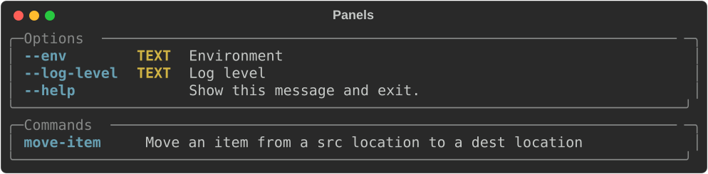

import { Code } from '@astrojs/starlight/components';
import panelsSimpleDecoratorsRaw from '@code_snippets/panels/panels_simple_decorators.py?raw';
import panelsSimpleKwargsRaw from '@code_snippets/panels/panels_simple_kwargs.py?raw';
import panelsSimpleArgumentsRaw from '@code_snippets/panels/panels_simple_arguments.py?raw';
import panelsSimpleArgumentsCombinedRaw from '@code_snippets/panels/panels_simple_arguments_combined.py?raw';
import panelsSimpleArgumentsHelpRaw from '@code_snippets/panels/panels_simple_arguments_help.py?raw';
import panelsCommandsRaw from '@code_snippets/panels/panels_commands.py?raw';
import panelsExtraKwargsRaw from '@code_snippets/panels/panels_extra_kwargs.py?raw';
import panelsDefaultsRenamedRaw from '@code_snippets/panels/panels_defaults_renamed.py?raw';
import panelsDefaultsOverrideConfigRaw from '@code_snippets/panels/panels_defaults_override_config.py?raw';

**rich-click** lets you configure grouping and sorting of command options and subcommands.
The containers which contain grouped options and subcommands are called panels:

By default, `RichCommand`s have a single panel for options named "Options", and `RichGroup`s have an additional panel for commands named "Commands".

**rich-click** allows you to control and customize everything about these panels:

- The default panels can be renamed and stylized.
- Options and commands can be split up across multiple panels.
- Positional arguments can be given a separate panel, or included in options panels.
- The styles of these panels can be modified.

:::note[Info]
Panels are a replacement of rich-click "groups," which are deprecated as of version 1.9.0.
We will support the old groups API for the foreseeable future, but its use is discouraged.

Although groups technically can be combined with panels, doing so can lead to unpredictable sorting behavior.

You can read the [rich-click v1.8 docs](https://ewels.github.io/rich-click/1.8/documentation/groups_and_sorting/) to learn more about groups API.
:::

## Introduction to API

The high-level API for defining panels is with the `@click.command_panel()` and `@click.option_panel()` decorators.

Under the hood, these decorators create **`RichPanel`** objects that are attached to the command.

### Options

Options panels handle parameters for your command:

<Code code={panelsSimpleDecoratorsRaw} lang="python" meta="{12-15}" />

Output

{/* RICH-CODEX working_dir: docs/code_snippets/panels */}

Alternatively, you can configure panels within the option itself.
If the panel is not created in a decorator, then one is created on the fly.

The following code generates the same output as the example above:

<Code code={panelsSimpleKwargsRaw} lang="python" meta="{7-12}" />

Output

Note that this output is the same as the previous example, even though it was defined differently.
{/* RICH-CODEX working_dir: docs/code_snippets/panels */}

### Arguments

Despite the name, options panels handle more than just options; they can also handle positional arguments.

Arguments can be given their own panel with the `show_arguments` config option:

<Code code={panelsSimpleArgumentsRaw} lang="python" meta="{11}" />

Output

{/* RICH-CODEX working_dir: docs/code_snippets/panels */}

Arguments can also be included in the options panel with the `group_arguments_options` config option (the `show_arguments` config option does not need to be set).

<Code code={panelsSimpleArgumentsCombinedRaw} lang="python" meta="{11}" />

Output

{/* RICH-CODEX working_dir: docs/code_snippets/panels */}

In **rich-click**, unlike base Click, arguments can have `help` text.
If `help=` if set for arguments, then the argument panel is automatically shown:

<Code code={panelsSimpleArgumentsHelpRaw} lang="python" meta="{7-8}" />

Output

{/* RICH-CODEX working_dir: docs/code_snippets/panels */}

### Commands

Sub-commands also have panels that are defined similarly to option panels:

<Code code={panelsCommandsRaw} lang="python" meta="{7-11}" />

Output

{/* RICH-CODEX working_dir: docs/code_snippets/panels */}

## Styles & Panel Help

`RichPanel` objects inherit their base style behaviors from the rich config by default, but this can be set on a per-panel basis.

Panels can also have help text.

The below example shows both of these things:

<Code code={panelsExtraKwargsRaw} lang="python" meta="{11-18}" />

Output

{/* RICH-CODEX working_dir: docs/code_snippets/panels */}

The `panel_styles` is passed into the outer `rich.panel.Panel()`, and the `table_styles` dict is pass as kwargs into the inner `rich.table.Table()`.

See the available arguments for the **rich** library `Table` and `Panel` objects for more information:

- [Table options](https://rich.readthedocs.io/en/latest/tables.html#table-options)
- [Panel options](https://rich.readthedocs.io/en/latest/reference/panel.html#rich.panel.Panel)
  and [Box styles](https://rich.readthedocs.io/en/latest/appendix/box.html#appendix-box)

## Overriding defaults

Default panel titles can be overridden with the config.
Renamed panels can still have their panel-level configurations modified.

<Code code={panelsDefaultsRenamedRaw} lang="python" meta="{14-16}" />

Output

{/* RICH-CODEX working_dir: docs/code_snippets/panels */}

Note that the rich config passes to subcommands, but panels are defined at the command level.
So running `move-item --help` from the above example _will_ rename the children's panels (because that's set in the parent's config), but it does _not_ pass the `panel_styles=` to the subcommand:

Output

{/* RICH-CODEX working_dir: docs/code_snippets/panels */}

Default panel styles are also handled by the config, and will be overridden when conflicting options are defined at the panel level.

<Code code={panelsDefaultsOverrideConfigRaw} lang="python" meta="{6-7, 15-16, 19}" />

Output

{/* RICH-CODEX working_dir: docs/code_snippets/panels */}

